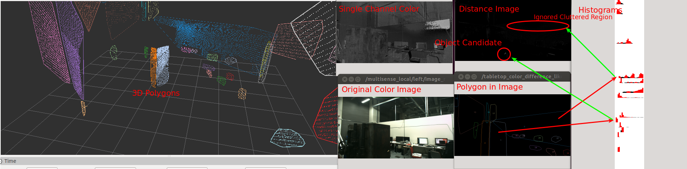

# TabletopColorDifferenceLikelihood


Compute likelihood of object on table based on color space histogram.
In tabletop object detection, color is a good feature to detect objects.
Idea is simple.

First compute "average" color of the pixels of the polygon.
Second compute "distance" between the "average" color and the pixel for each pixels in the polygon.

However, there is problem in "average" and "distance".
If polygon is clean, we can get expected result from simple average and distance computation.
However if polygon is cluttered, we will get unexpected result because average of pixels is fesible
feature.

TabletopColorDifferenceLikelihood uses histogram to resolve the issue.

1. Compute histogram of the pixels in a polygon.
2. Mark top N histograms which covers the area which is computed
by multiplying given ratio and all the area of hisotgrams.
3. Compute minimum distance between a pixel and the N histograms for each pixel in the polygon.

## Subscribing Topic
* `~input` (`sensor_msgs/Image`)

  Single channel color image

* `~input/polygons` (`jsk_recognition_msgs/PolygonArray`)

  Polygon messages

* `~input/camera_info` (`sensor_msgs/CameraInfo`)

  Input camera info


## Publishing Topic
* `~output` (`sensor_msgs/Image`)

  Result distance image.

* `~debug/histogram_image` (`sensor_msgs/Image`)

  Image to visualize histogram. Red bars are extracted top N histograms.

* `~debug/polygon_image` (`sensor_msgs/Image`)

  Image to visualize polygons projected on 2-D image.


## Parameters
* `~tf_queue_size` (Int, default: `10`)

  Queue length of tf message filters

* `~cyclic_value` (Bool, default: `True`)

  Set to true if the channel is circular value.

* `~bin_size` (Int, default: `30`)

  The number of bins in histogram.

  This paramteter can be changed by `dynamic_reconfigure`.

* `~pixel_min_value` (Int, default: `0`)
* `~pixel_max_value` (Int, default: `180`)

  Minimum and maximum value in the color space.

  This paramteter can be changed by `dynamic_reconfigure`.

* `~histogram_top_n_ratio` (Float, default: `0.5`)

  Ratio of extracting top N histograms.

  This paramteter can be changed by `dynamic_reconfigure`.


## Sample

```bash
roslaunch jsk_perception sample_tabletop_color_difference_likelihood.launch
```
