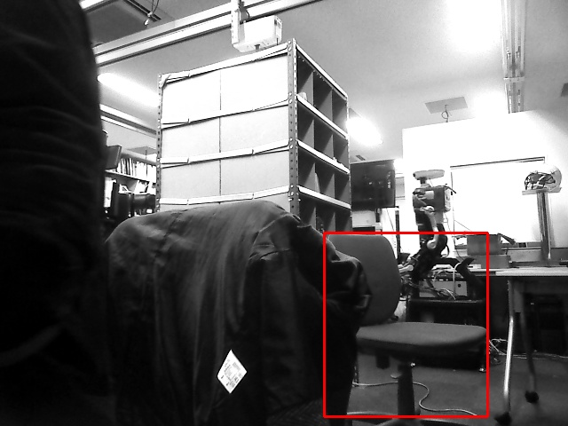

TemplateMatchDetector
=====================

What is this?
-------------

Detect object by template matching

Subscribing Topic
-----------------

* ``~input`` (``sensor_msgs/Image``)

  Raw image.

* ``~input/info`` (``sensor_msgs/CameraInfo``)

  Camera Info.

Publishing Topic
----------------

* ``~output/rect`` (``jsk_recognition_msgs/RectArray``)

  Rectangles of detected objects

* ``~output/viz`` (``sensor_msgs/Image``)

  Visualized image of detection result.

Parameters
----------

* ``~template_name`` (String, default: ``template.png``)

  Template image's file name

* ``~min_scale`` (Float, default: ``0.4``)

  Min scale of template

* ``~max_scale`` (Float, default: ``1.6``)

  Max scale of template

* ``~resize_num`` (Int, default: ``20``)

  the number of resizing template

* ``~matching_thre``, (Float, default: ``0.7``)

  Threshold of matching result

* ``~target_num``, (Int, default: ``6``)

  The number of target

* ``~max_detect_num``, (Int, default: ``15000``)

  If detected rectangle number is over max_detect_num, skip calculation.

* ``~sort_op``, (Int, default: ``1``)

  Option of sorting target. 0:horizontal, 1:vertical

* ``~screen_debug``, (Bool, default: ``True``)

  Toggle of screen_debug

* ``~specify_target``, (Bool, default: ``True``)

  Specify the number of target

* ``~flip_template``, (Bool, default: ``True``)

  If ``True`` Using flipped template

Sample
------

.. code-block:: bash

  roslaunch jsk_perception sample_template_matching.launch
