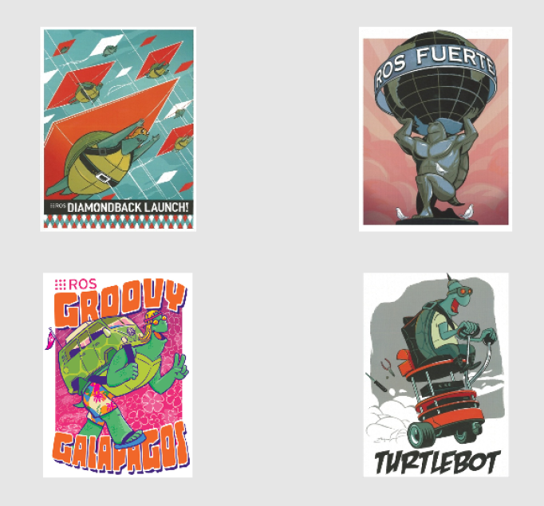

tile_image.py
==============

What is this?
-------------

Publish an image topic by tiling image topics specified.

Subscribing Topic
-----------------
The subscribing topics should be specified with rosparam.
See **Parameters**.

Publishing Topic
----------------

* ``~output`` (``sensor_msgs/Image``)

  Tiled image.

Parameters
----------

* ``input_topics`` (type: ``StringArray``, required)

  input topic names should be specified like::

    <node name="tile_image" pkg="jsk_perception" type="tile_image.py" output="screen">
      <rosparam>
        input_topics: [img1/output, img2/output, img3/output, img4/output]
      </rosparam>
    </node>

* ``no_sync`` (type: ``Bool``, default: ``False``)

  set ``no_sync`` parameter true if you do not want to synchronize timestamps of ``input_topics``

* ``queue_size`` (type: ``Int``, default: ``10``)

  The queue size for ``message_filters.TimeSynchronizer`` or ``message_filters.ApproximateTimeSynchronizer``.

* ``slop`` (type: ``Float``, default: ``1.0``)

  The slop time in second for ``message_filters.ApproximateTimeSynchronizer``.

* ``draw_topic_name`` (type: ``Bool``, default: ``False``)

  Draw topic name on each image.

* ``font_scale`` (type: ``Float``, default: ``0.8``)

  Font size to draw topic names.

* ``shape`` (type: ``FloatArray``, default: ``None``)

  Tile shape like ``[2, 4]`` in [Y, X] order.
  If ``None``, shape is automatically decided to be square
  as much as possible.

CLI
---
::

    rosrun jsk_perception tile_image.py _input_topics:='[img1/output, img2/output]'

Sample
------
::

    roslaunch jsk_perception tile_image.launch
