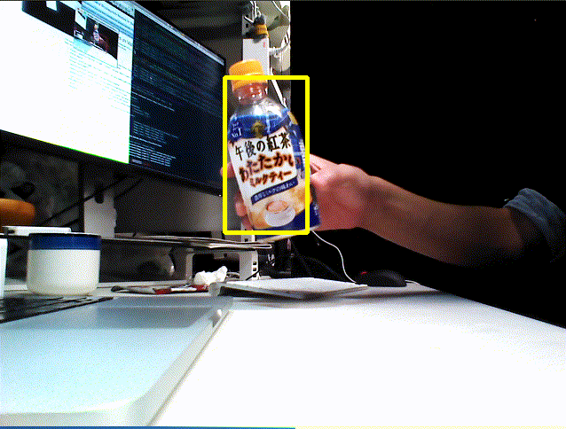
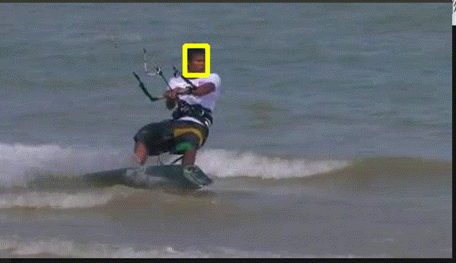

# TrTr (Tracker with Transformer)
 


**TrTr** (Tracker with Transformer)  is a visual tracker method based on Transformer attention mechanism.
Please check [this paper](https://drive.google.com/file/d/1FE4l8A1GcjJgbetQr4pT5_0fkRXhHhbE/view?usp=sharing) for more details.
The [original implmentation](https://github.com/tongtybj/TrTr) is based on Pytorch, but we extract the baseline (offline) inference part shown in following figure, and convert the related network from pytorch to ONNX and TensorRT to support running on CPU and GPU.
Especially, we also provide FP16 model for TensorRT to achieve a significant fast tracking inference.


## Enviroment Requirements

### CPU mode

Currently, we only support inferenmce with architecture of x86_64.

### GPU mode

If you want to use with GPU mode. Please intall following dependencies with correct version

#### 1. CUDA Toolkit:
version >= 10.2

following the [installation tutorial](https://developer.nvidia.com/cuda-toolkit)
   
**note**: if you choose 10.2, please apply the cuda10.2 patches mentioned [here](https://developer.nvidia.com/cuda-10.2-download-archive?target_os=Linux&target_arch=x86_64&target_distro=Ubuntu&target_version=1804&target_type=deblocal)

#### 2. cuDNN
version >= 8.0.3

following the [installation tutorial](https://developer.nvidia.com/cudnn)

#### 3. TensorRT
version >= 7.2.2

following the [installation tutorial](https://developer.nvidia.com/tensorrt-getting-started)

## Subscribing Topic

* `~input` (`sensor_msgs/Image`)

  Input image with three channel

* `~input/rect` (`jsk_recoginition_msgs/RectArray`)

  Initial rect of object to track.


## Publishing Topic

* `~output/vis` (`sensor_msgs/Image`)

  Image with tracking result


* `~output/rect` (`jsk_recoginition_msgs/RectArray`)

  Rect of tracking object


## Parameters

* `~device` (Int, default: `0`)

  CPU (with ONNX): `0`; GPU (with TensorRT): `1`

* `~queue_size` (Int, default: `10`)

  How many messages you allow about the subscriber to keep in the queue.
  This should be big when there is much difference about delay between two topics.

* `~approximate_sync` (Bool, default: `False`)

  Whether to use approximate for input topics.


## Sample

```bash
roslaunch jsk_perception sample_trtr_tracker.launch
```
**note**: you can add option `device` to choose `0` for CPU mode and `1` for GPU mode

## Test

```bash
rostest jsk_perception trtr_tracker.test device:=1
```
We provide two typical samples from OTB2015 to show the performance of this tracker.

## Performance

|  Specification |  CPU <br> (ONNX)  | GPU <br> (TensorRT)  |
| ---- | ---- | ---- |
|  ThinkPad P1 Gen3 <br> CPU: Intel Core i7-10750H <br> GPU: NVIDIA Quadro T2000  |  13 FPS  | 100 FPS　(FP16)  |
|  Home Desktop <br> CPU:  Intel Core i7-4790K <br> GPU: NVIDIA GeForce RTX 2060 SUPER  |  12 FPS  | 180 FPS　(FP16)  |
| Nvidia Jetson TX2   |  -  |  TODO  |
