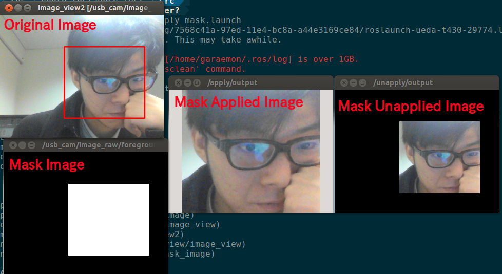

# UnapplyMaskImage


Unapply mask image to the size of original image.

## Subscribing Topic
* `~input` (`sensor_msgs/Image`)

  Masked image.

* `~input/mask` (`sensor_msgs/Image`)

  Mask image.


## Publishing Topic
* `~output` (`sensor_msgs/Image`)

  Unmasked image. The region outside of mask image is filled by black (0).


## Parameters
* `~approximate_sync` (Bool, default: `false`)

  Approximately synchronize inputs if it's true.


## Sample

```bash
roslaunch jsk_perception sample_unapply_mask_image.launch
```
