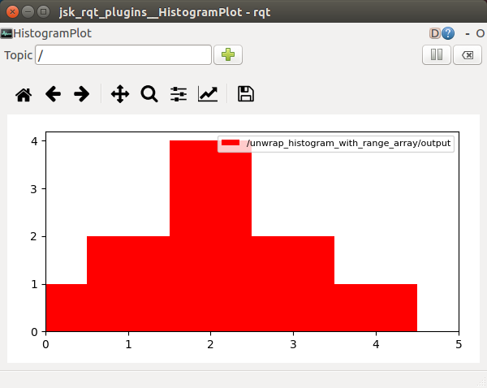

unwrap_histogram_with_range_array.py
====================================

What is this?
-------------

Unwrap a HistogramWithRangeArray message and publish its element.

Subscribing Topic
-----------------

* ``~input`` (``jsk_recognition_msgs/HistogramWithRangeArray``)

  Histogram array.

Publishing Topic
----------------

* ``~output`` (``jsk_recognition_msgs/HistogramWithRange``)

  Histogram

Parameters
----------

* ``~index`` (Int, default: ``0``)

  Histogram index to be extracted from ``~input``.

Sample
------

.. code-block:: bash

  roslaunch jsk_perception sample_unwrap_histogram_with_range_array.launch
