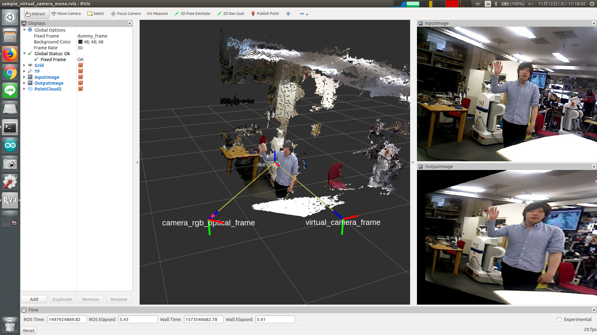

# virtual_camera_mono



Calculate perspective transformation from TF frame and apply it to the input image.

## Subscribing Topics

* `image` (`sensor_msgs/Image`)

  Input image.

* `camera_info` (`sensor_msgs/CameraInfo`)

  Input camera info.

  This topic name is resolved from `image` by image_transport.

* `view_point` (`geometry_msgs/TransformStamped`, optional)

  Pose of virtual camera relative to `~frame_id`.

  This pose is initialized from `~initial_pos` and `~initial_rot`.

* `target_polygon` (`geometry_msgs/PolygonStamped`, optional)

  Target plane polygon.

  The polygon is initialized from
  `[[0, 1, 0], [0, -1, 0], [0, -1, -1], [0, 1, -1]]`.


## Publishing Topics

* `~image` (`sensor_msgs/Image`)

  Output image to which perspective transformation was applied.

* `~camera_info` (`sensor_msgs/CameraInfo`)

  Camera info of virtual camera.


## Parameters

* `~frame_id` (String, default: `/elevator_inside_panel`)

  Target frame ID.

* `~child_frame_id` (String, default: `/virtual_camera_frame`)

  Frame ID of virtual camera used in published topics.

* `~initial_pos` (List of Float, default: `[0.7, 0.0, 0.0]`)

  Initial position of virtual camera relative to `~frame_id`.

* `~initial_rot` (List of Float, default: `[0.5, 0.5, -0.5, -0.5]`)

  Initial rotation of virtual camera relative to `~frame_id` in quaternion.

* `~interpolation_method` (Int, default: `1`)

  Choose from `INTER_NEAREST (0)`, `INTER_LINEAR (1)`, `INTER_AREA (2)`,
  `INTER_CUBIC (3)` and `INTER_LANCZOS4 (4)`.

  This parameter can be changed by `dynamic_reconfigure`.


## Sample

```bash
roslaunch jsk_perception sample_virtual_camera_mono.launch
```
