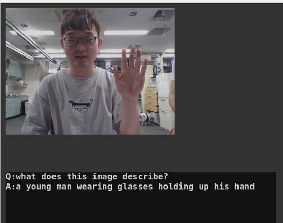
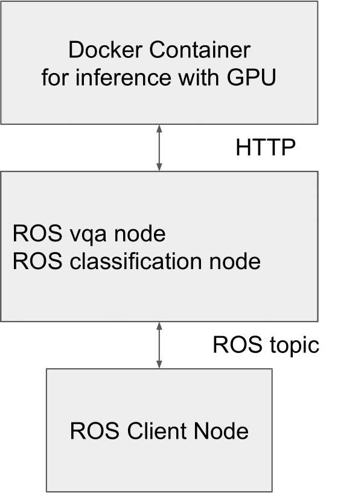

# vqa_node.py


The ROS node for Visual Question Answering(VQA).

## System Configuration


This node requires to work with the Docker Container for inference. Please build the container at first following Setup instruction.

## Setup

### Prerequisite
This node requires NVIDIA GPU and more than 4GB GRAM to work properly.
You have to install nvidia-container-toolkit for using GPU with docker. Please follow [official instruction](https://docs.nvidia.com/datacenter/cloud-native/container-toolkit/install-guide.html).

### Build the docker image
You have to build the docker image of OFA

```shell
roscd jsk_perception/docker
make
```

## Subscribing topic
* `~image` (`sensor_msgs/Image`)

  Input image

## Publishing topic
* `~result` (`jsk_recognition_msgs/VQAResult`)
  
  VQA result
  
* `~result/image` (`sensor_msgs/Image`)
  
  Images used for inference
  
* `~visualize` (`std_msgs/String`)

  VQA question and answer to visualize
  
## Action topic
* `~inference_server/goal` (`jsk_recognition_msgs/VQATaskActionGoal`) 
  
  VQA request with custom questions and image
  
* `~inference_server/result` (`jsk_recognition_msgs/VQATaskActionResult`)
  
  VQA result of `~inference_server/goal`

## Parameters
* `~host` (String, default: `localhost`)

  The host name or IP of inference container 

* `~port` (Integer, default: `8080`)

  The HTTP port of inference container

## Dynamic Reconfigure Parameters
* `~questions` (string, default: `what does this image describe?`) 

  Default questions used for subscribing image topic. 

  You can send multiple questions with separating semicolon like the below.
  ```
  What does this image describe?;What kinds of objects exists?
  ```

## Sample

### Run inference container on another host or another terminal
In the remote GPU machine,
```shell
cd jsk_recognition/jsk_perception/docker
./run_jsk_vil_api --port (Your vacant port) --ofa_task caption --ofa_model_scale huge
```


`--ofa_task` should be `caption` or `vqa`. Empirically, the output results are more natural for VQA tasks with the Caption model than with the VQA model in OFA. 


If you encounter GPU ram shortage, please make `ofa_model_scale` `large` .


In the ROS machine,
```shell
roslaunch jsk_perception vqa.launch port:=(Your inference container port) host:=(Your inference container host) VQA_INPUT_IMAGE:=(Your image topic name) gui:=true 
```


### Run both inference container and ros node in single host 
```
roslaunch jsk_perception vqa.launch run_api:=true VQA_INPUT_IMAGE:=(Your image topic name) gui:=true 
```
