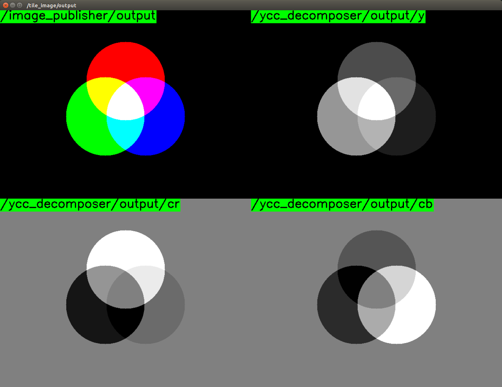

# YCCDecomposer



Decompose BGR/RGB image into separate planes in [YCbCr color space](http://en.wikipedia.org/wiki/YCbCr).

## Subscribing Topic
* `~input` (`sensor_msgs/Image`)

  Input image.

## Publishing Topic
* `~output/y` (`sensor_msgs/Image`)
* `~output/cr` (`sensor_msgs/Image`)
* `~output/cb` (`sensor_msgs/Image`)

  Y, Cr and Cb separated planes. Each image has CV_8U encoding.


## Sample

```bash
roslaunch jsk_perception sample_ycc_decomposer.launch
```
