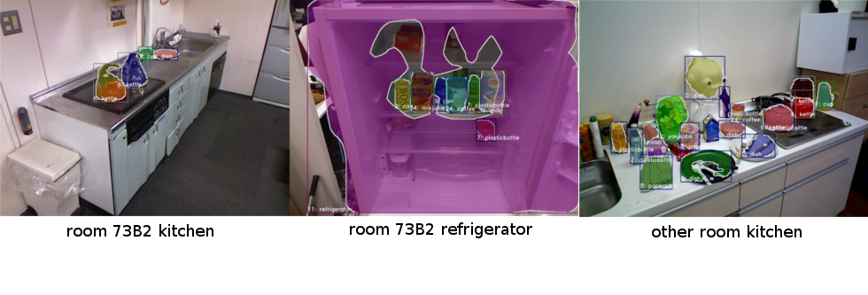
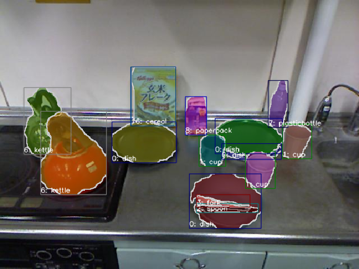

# Train Mask-RCNN

This page shows how to train Mask-RCNN with your own dataset.

Mask-RCNN is a neural network model used for instance segmentation.

Any size of image can be applied to this network as long as your GPU has enough memory.


## Available Dataset Class

`InstanceSegmentationDataset` (imported from `jsk_recognition_utils.datasets`)

This class assumes the following directory structure for each split.

```
path_to_awesome_dataset/
|-- JPEGImages
|   |-- foo.jpg
|   |-- bar.jpg
|   `-- etc.
|-- SegmentationClass
|   |-- foo.npy
|   |-- bar.npy
|   `-- etc.
|-- SegmentationObject
|   |-- foo.npy
|   |-- bar.npy
|   `-- etc.
|-- class_names.txt
`-- etc.
```

## Arguments

- `--train_dataset_dir` (`string`, default: `$(rospack find jsk_perception)/learning_datasets/kitchen_dataset/train`)
- `--val_dataset_dir` (`string`, default: `$(rospack find jsk_perception)/learning_datasets/kitchen_dataset/test`)

  Directory name which contains dataset for training and validation respectively.

- `--model_name` (`string`, default: `resnet50`)

  Model name. Currently, `vgg16`, `resnet50` and `resnet101` are supported.

- `--gpu` (`int`, default: `0`)

  GPU id. `-1` means CPU mode, but we recommend to use GPU for much faster computing.

- `--batch_size` (`int`, default: `1`)

  Number of images used simultaneously in each iteration.

  You should decrease this number when you face memory allocation error.

- `--max_epoch` (`int`, default: `100`)

  Stop trigger for training.

- `--lr` (`float`, default: `0.00125`)

  Learning rate.

  Perhaps you should decrease this number when you face NaN value as loss.

- `--weight_decay` (`float`, default: `0.0001`)

  Weight decay.

- `--out_dir` (`string`, default: `${ROS_HOME}/learning_logs/<timestamp>`)

  Output directory name.

- `--progressbar_update_interval` (`float`, default: `10`)

  Interval for updating progress bar shown while training.

  The unit is [iteration].

- `--print_interval` (`float`, default: `100`)
- `--print_interval_type` (`string`, default: `iteration`)

  Interval for printing information like current epoch, elapsed time, loss, etc. on terminal.

  Note that `XXX_interval_type` can be chosen from {'epoch', 'iteration'}.

- `--log_interval` (`float`, default: `10`)
- `--log_interval_type` (`string`, default: `iteration`)

  Interval for logging information to `<out_dir>/log.json`.

- `--plot_interval` (`float`, default: `5`)
- `--plot_interval_type` (`string`, default: `epoch`)

  Interval for plotting Mean Average Precison to `<out_dir>/accuracy_plot.png`, and loss to `<out_dir>/loss_plot.png`.

- `--eval_interval` (`float`, default: `10`)
- `--eval_interval_type` (`string`, default: `epoch`)

  Interval for running evaluation.

- `--save_interval` (`float`, default: `10`)
- `--save_interval_type` (`string`, default: `epoch`)

  Interval for saving snapshot of model to `<out_dir>/model_snapshot.npz`.

  Trainer listens to loss for validation dataset according to this interval, and saves snapshot when the loss value becomes minimum.


Output
------

All these files will be automatically generated under `<out_dir>`.

- `accuracy_plot.png`
- `fg_class_names.yaml`
- `log.json`
- `loss_plot.png`
- `model_snapshot.npz`
- `network_architecture.dot`
- `params.yaml`


Usage
-----

```
rosrun jsk_perception train_mask_rcnn.py [ARGS]
```


Sample Output
-----

There are some pre-trained mask rcnn model on jsk_perception.\
Getting trained data by build `jsk_perception` or run script [install_trained_data](https://github.com/jsk-ros-pkg/jsk_recognition/blob/master/jsk_perception/scripts/install_trained_data.py)

`73b2 kitchen model` is some of the typical example of pre-trained mask rcnn model on jsk_perception.\
The results of mask rcnn using `73b2 kitchen model` are as follows.

Click the below image to see more mask rcnn results.
[](https://jsk-recognition.readthedocs.io/en/latest/jsk_perception/training_scripts/73b2_kitchen_mask_rcnn_result.html)


Sample usage with pre-trained model
-----
You can use `73b2 kitchen model` with jsk_perception node.
```
roslaunch jsk_perception sample_mask_rcnn_73b2_kitchen.launch
```
The result is displayed on the screen as a `/mask_rcnn_73b2_kitchen/output/viz` topic like below image.

[](https://jsk-recognition.readthedocs.io/en/latest/jsk_perception/training_scripts/73b2_kitchen_mask_rcnn_result.html)

