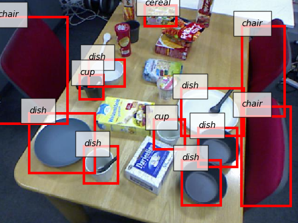

# Train SSD

This page shows how to train SSD with your own dataset.

SSD is a neural network model used for object detection.

## Available Dataset Class

`DetectionDataset` (imported from `jsk_recognition_utils.datasets`)

This class assumes the following directory structure for each split.

```
path_to_awesome_dataset/
|-- JPEGImages
|   |-- foo.jpg
|   |-- bar.jpg
|   `-- etc.
|-- SegmentationClass
|   |-- foo.npy
|   |-- bar.npy
|   `-- etc.
|-- SegmentationObject
|   |-- foo.npy
|   |-- bar.npy
|   `-- etc.
|-- class_names.txt
`-- etc.
```

`BboxDetectionDataset` (imported from `jsk_recognition_utils.datasets`)

This class assumes the following directory structure for each split.
This can be generated using [labelme](https://github.com/wkentaro/labelme/tree/master/examples/bbox_detection)

```
path_to_awesome_dataset/
|-- JPEGImages
|   |-- foo.jpg
|   |-- bar.jpg
|   `-- etc.
|-- Annotations
|   |-- foo.xml
|   |-- bar.xml
|   `-- etc.
|-- AnnotationsVisualization (not necessary)
|   |-- foo.jpg
|   |-- bar.jpg
|   `-- etc.
`-- class_names.txt
```

## Arguments

- `--train-dataset-dir` (`string`, default: `$(rospack find jsk_perception)/learning_datasets/kitchen_dataset/train`)
- `--val-dataset-dir` (`string`, default: `$(rospack find jsk_perception)/learning_datasets/kitchen_dataset/test`)

  Directory name which contains dataset for training and validation respectively.

- `--dataset-type` (`string`, default: `instance`)

  Choose dataset type. If you use `DetectionDataset` structure, choose `instance`. If you use `BboxDetectionDataset`, choose `bbox`.

- `--model-name` (`string`, default: `ssd512`)

  Model name. Currently, `ssd300` and `ssd512` are supported.

- `--gpu` (`int`, default: `0`)

  GPU id. `-1` means CPU mode, but we recommend to use GPU for much faster computing.

- `--batch-size` (`int`, default: `8`)

  Number of images used simultaneously in each iteration.

  You should decrease this number when you face memory allocation error.

- `--max-epoch` (`int`, default: `100`)

  Stop trigger for training.

- `--out-dir` (`string`, default: `${ROS_HOME}/learning_logs/<timestamp>`)

  Output directory name.

## Output

All these files will be automatically generated under `<out_dir>`.

- `log.json`
- `model_snapshot.npz`

## Usage

```
rosrun jsk_perception train_ssd.py [ARGS]
```

## Sample usage with pre-trained model

There are some pre-trained SSD model on jsk_perception.\
Getting trained data by build `jsk_perception` or run script [install_trained_data](https://github.com/jsk-ros-pkg/jsk_recognition/blob/master/jsk_perception/scripts/install_trained_data.py)

You can use `73b2 kitchen model` with jsk_perception node.
```
roslaunch jsk_perception sample_ssd_object_detector_73b2_kitchen.launch
```

## Sample Output

`73b2 kitchen model` is some of the typical example of pre-trained SSD model on jsk_perception.\
The results of SSD using `73b2 kitchen model` are as follows.


