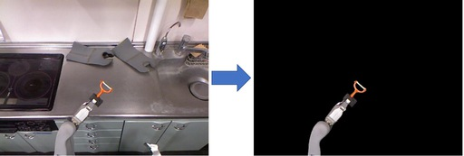

remove_background.py
====================

What is this?
-------------

Create a mask image by removing images background using `Rembg https://github.com/danielgatis/rembg`_.

Subscribing Topic
-----------------

* ``~input`` (``sensor_msgs/Image``)

  Input RGB image.

Publishing Topic
----------------

* ``~output/raw`` (``sensor_msgs/Image``)

  Rembg performs masking with a value between 0~255. ``~output``

* ``~output`` (``sensor_msgs/Image``)

  Mask image. The difference from ``~output/raw`` is that the value here is 255 for pixels with a value greater than ``~mask_threshold`` and 0 otherwise.

Parameters
----------

* ``~pretrained_model`` (String, Required)

  Currently ``$(rospack find jsk_perception_3rdparty)/trained_data/rembg/u2net/u2net.onnx`` is only supported.

* ``~mask_threshold`` (Int, Default: ``122``)

  Mask threshold.

* ``~negative`` (Bool, Default: ``False``)

  Extact mask or the negative.

Example
-------

.. code-block:: bash

   roslaunch jsk_perception_3rdparty sample_remove_background.launch
