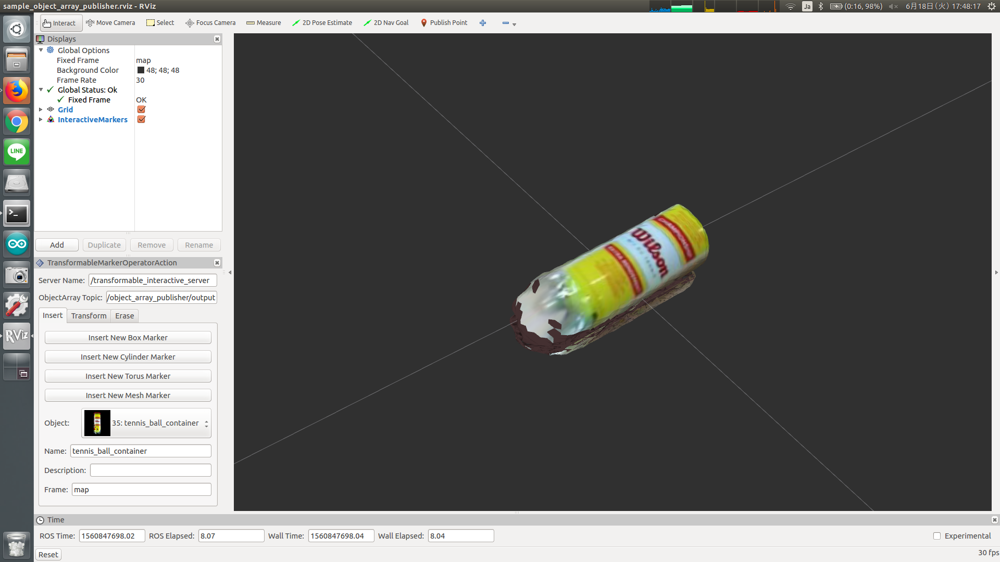

# object_array_publisher.py



## What is this?

Get mesh as rosparam and publish them as `jsk_recognition_msgs/ObjectArray`.


## Publishing Topic

* `~output` (`jsk_recognition_msgs/ObjectArray`)

  Output meshes.


## Parameters

* `~objects` (List, required)

  List of mesh.

* `~latch` (Bool, default: `False`)

  If true, oneshot publish is enabled and timestamp is fixed.

Example parameters are below.

```xml
<rosparam>
  latch: true
  objects:
    - id: 1
      name: avery_binder
      image_resources:
        - package://jsk_arc2017_common/data/objects/avery_binder/top.jpg
      mesh_resource: package://jsk_arc2017_common/data/objects/avery_binder/mesh/mesh.obj
    - id: 35
      name: tennis_ball_container
      class_id: 2
      class_name: cylinder
      image_resources:
        - package://jsk_arc2017_common/data/objects/tennis_ball_container/top.jpg
      mesh_resource: package://jsk_arc2017_common/data/objects/tennis_ball_container/mesh/mesh.obj
      weight: 0.217
      dimensions:
        x: 0.077
        y: 0.218
        z: 0.077
</rosparam>
```


## Sample

```bash
roslaunch jsk_recognition_msgs sample_object_array_publisher.launch JSK_INTERACTIVE_MARKER_INSTALLED:=true  # default: false
```
