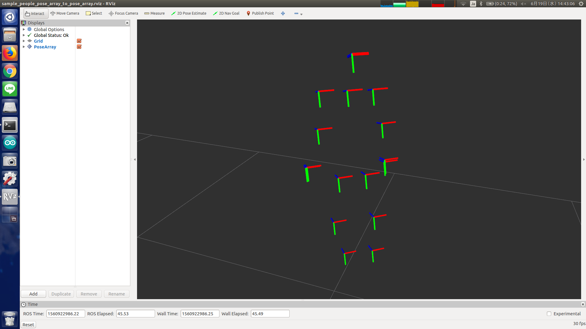

# people_pose_array_to_pose_array.py



## What is this?

Subscribe `jsk_recognition_msgs/PeoplePoseArray` and publish them as `geometry_msgs/PoseArray`.


## Subscribing Topic

* `~input` (`jsk_recognition_msgs/PeoplePoseArray`)

  Input human poses.


## Publishing Topic

* `~output` (`geometry_msgs/PoseArray`)

  Output poses.


## Parameters

None.


## Sample

```bash
roslaunch jsk_recognition_msgs sample_people_pose_array_to_pose_array.launch
```
