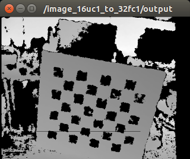

# image_16uc1_to_32fc1.py



## What is this?

Convert encoding of depth image: uint16 [mm] -> float32 [m].

It is recommended to use [depth_image_proc/convert_metric](http://wiki.ros.org/depth_image_proc).


## Subscribing Topic

* `~input` (`sensor_msgs/Image`)

  Input depth image whose encoding is uint16.


## Publishing Topic

* `~output` (`sensor_msgs/Image`)

  Output depth image whose encoding will be float32.


## Sample

```bash
roslaunch jsk_recognition_utils sample_image_16uc1_to_32fc1.launch
```
