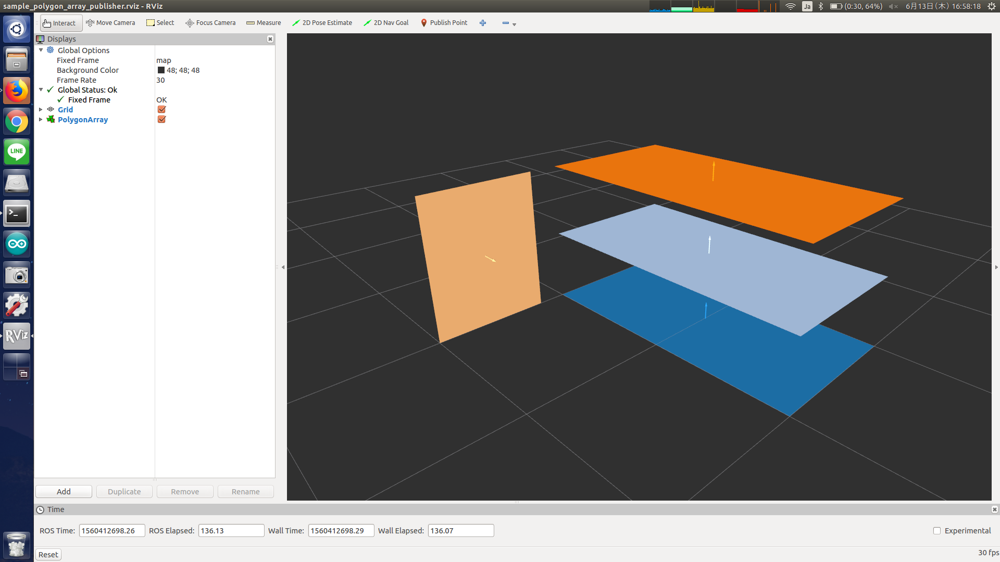

# polygon_array_publisher.py



## What is this?

Get polygons as rosparam and publish them as `jsk_recognition_msgs/PolygonArray`.


## Publishing Topic

* `~output` (`jsk_recognition_msgs/PolygonArray`)

  Output polygons.

* `~output/coefficients` (`jsk_recognition_msgs/ModelCoefficientsArray`)

  Output coefficients. This topic will be published if `~publish_coeffs` is `True` and each polygon is in planar.

## Parameters

* `~polygons` (List, required)

  List of polygon.

  Each polygon must have `points` field, which is a list of vertices.

  You can also fill `label` and `likelihood` field for each polygon.

* `~frame_id` (String, required)

  Frame ID of polygons.

* `~publish_rate` (Float, default: `1.0`)

  Publish rate [Hz].

* `~publish_coeffs` (Bool, default: `False`)

    If this value is true and each polygon is in planar, publish `jsk_recognition_msgs/ModelCoefficientsArray`.

Example parameters are below.

```xml
<rosparam>
  frame_id: base_link
  publish_coeffs: true
  polygons:
  - points:
    - [1.0, -1.0, 0.0]
    - [2.0, -1.0, 0.0]
    - [2.0,  1.0, 0.0]
    - [1.0,  1.0, 0.0]
    label: 1
    likelihood: 0.8
  - points:
    - [1.0, -1.0, 0.5]
    - [2.0, -1.0, 0.5]
    - [2.0,  1.0, 0.5]
    - [1.0,  1.0, 0.5]
    label: 2
    likelihood: 0.6
</rosparam>
```


## Sample

```bash
roslaunch jsk_recognition_utils sample_polygon_array_publisher.launch
```
