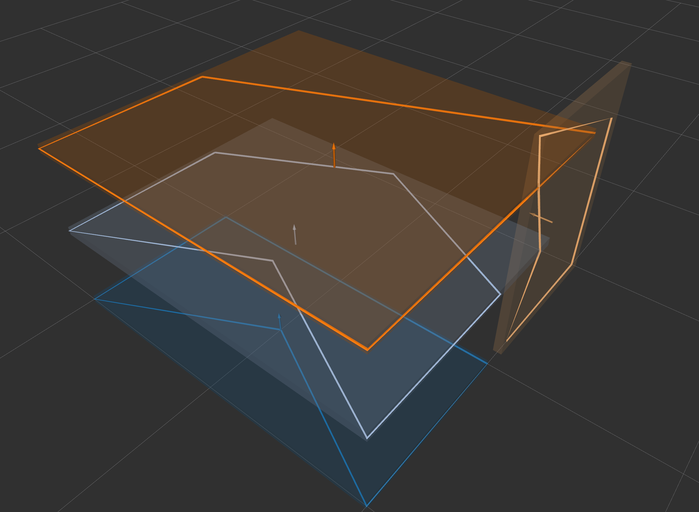

# polygon_array_to_box_array.py



## What is this?

Convert `jsk_recognition_msgs/PolygonArray` to `jsk_recognition_msgs/BoundingBoxArray` containing the polygons.
For example, this can be used when users use polygon for collision avoidance programs.


## Subscribing Topic

* `~input/polygons` (`jsk_recognition_msgs/PolygonArray`)

  Input polygon array.


* `~input/coefficients` (`jsk_recognition_msgs/ModelCoefficientsArray`)

  Input coefficients array.
  We assume coeffecients for plane detection.


## Publishing Topic


* `~output/boxes` (`jsk_recognition_msgs/BoundingBoxArray`)

    Output boxes.
    Each box contains each input polygon.
    The long side of the bounding box is the x-axis, and the normal direction is the z-axis.

* `~output/polygons` (`jsk_recognition_msgs/PolygonArray`)

  Output polygons.

* `~output/coefficients` (`jsk_recognition_msgs/ModelCoefficientsArray`)

  Output coeffecients.


## Parameters

* ``~thickness`` (Float, default: ``0.0001``)

  Thickness of bounding box.


## Sample

```bash
roslaunch jsk_recognition_utils sample_polygon_array_to_box_array.launch
```
