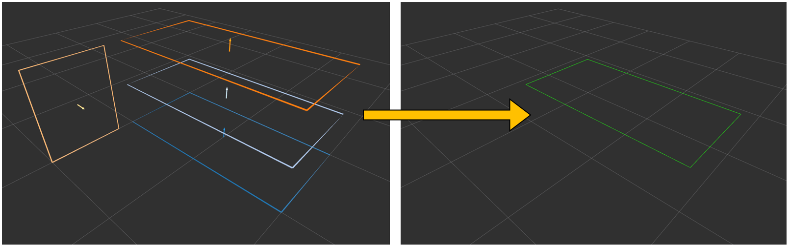

# polygon_array_to_polygon.py



## What is this?

Convert `jsk_recognition_msgs/PolygonArray` to `geometry_msgs/PolygonStamped`.


## Subscribing Topic

* `~input` (`jsk_recognition_msgs/PolygonArray`)

  Input polygon array.


## Publishing Topic

* `~output` (`geometry_msgs/PolygonStamped`)


## Parameters

* ``~index`` (Int, default: ``-1``)

  Index value where polygon is extracted from polygon array.
  Please note that negative index is skipped.


## Sample

```bash
roslaunch jsk_recognition_utils sample_polygon_array_to_polygon.launch
```
