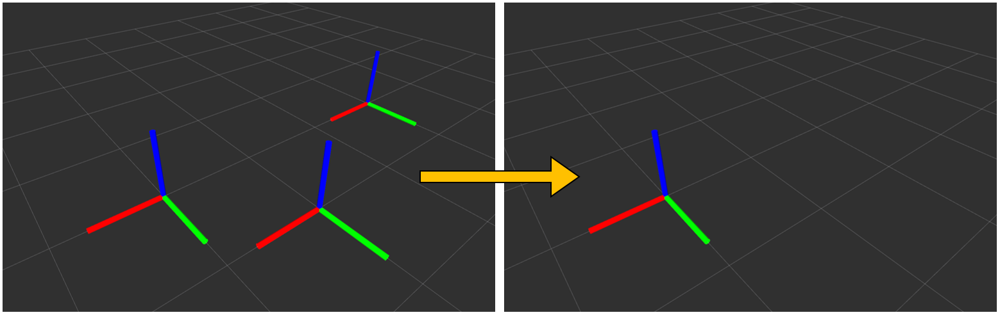

# pose_array_to_pose.py



## What is this?

Convert `geometry_msgs/PoseArray` to `geometry_msgs/PoseStamped`.


## Subscribing Topic

* `~input` (`geometry_msgs/PoseArray`)

  Input pose array.


## Publishing Topic

* `~output` (`geometry_msgs/PoseStamped`)


## Parameters

* ``~index`` (Int, default: ``-1``)

  Index value where pose is extracted from pose array.
  Please note that negative index is skipped.


## Sample

```bash
roslaunch jsk_recognition_utils sample_pose_array_to_pose.launch
```
