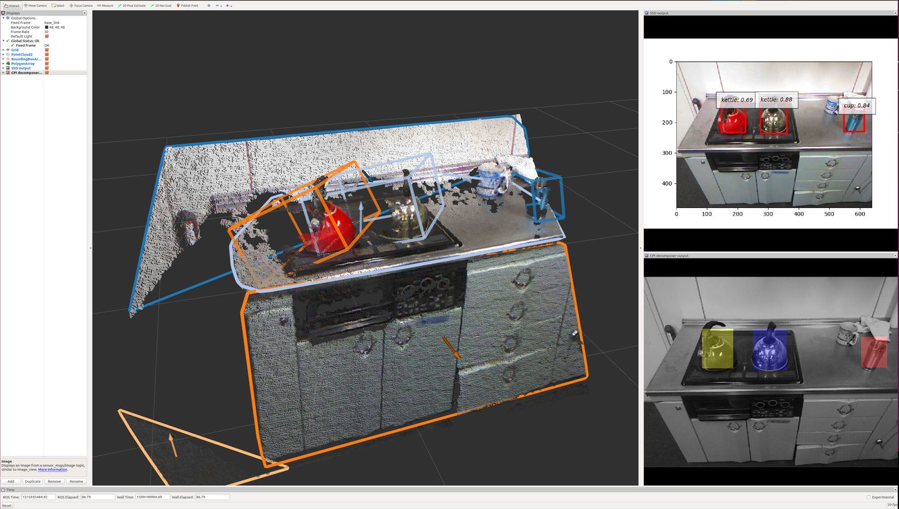
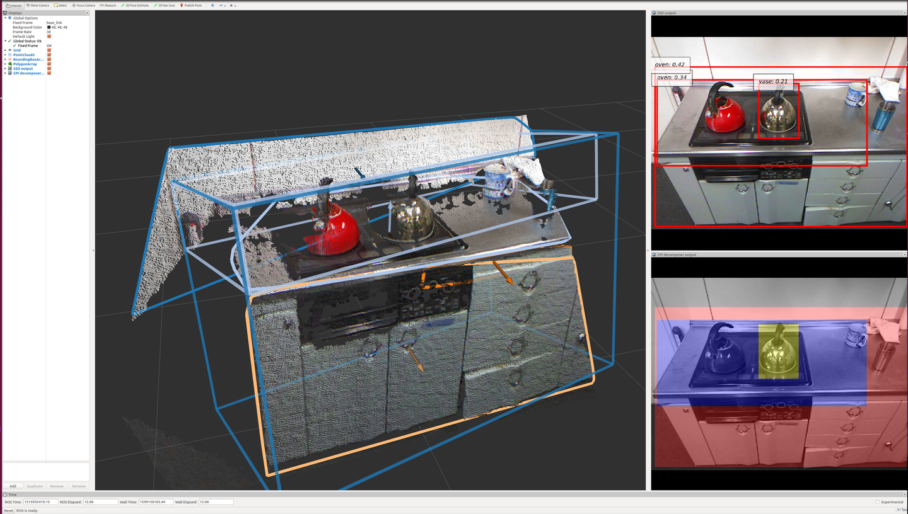

# rect_array_to_cluster_point_indices.py

## What is this?

Convert `jsk_recognition_msgs/RectArray` to `jsk_recognition_msgs/ClusterPointIndices`

## Subscribing Topic

* `~input` (`jsk_recognition_msgs/RectArray`)

  Input rect array.

* `~input/info` (`sensor_msgs/CameraInfo`)

  Input camera info. Subscribe only when `use_info` is `true`.

## Publishing Topic


* `~output` (`jsk_recognition_msgs/ClusterPointIndices`)

  Output cluster point indices.

## Parameters

* `~use_info` (Bool, Default: `false`)

  Subscribe camera_info topic or not

* `~img_width`: (Int, required)

  Image width. Required only when `use_info` is `false`.

* `~img_height`: (Int, required)

  Image height. Required only when `use_info` is `false`.

* `~queue_size` (Int, Default: `10`)

  Queue size for `message_filters`. Used only when `use_info` is `true`.

* `~approximate_sync` (Bool, Default: `false`)

  Use approximate_sync or not. Used only when `use_info` is `true`.

* `~slop` (Float, Default: `0.1`)

  Slop size for `message_filters`. Used only when `use_info` is `true`.


## Sample

```bash
roslaunch jsk_recognition_utils sample_rect_array_to_cluster_point_indices.launch
```


## Sample with SSD object detector

### SSD object detector with GPU or CPU



```bash
# CPU
roslaunch jsk_recognition_utils sample_ssd_to_bounding_box_73b2_kitchen.launch gpu:=-1
# GPU
roslaunch jsk_recognition_utils sample_ssd_to_bounding_box_73b2_kitchen.launch gpu:=0
```

### SSD object detector with TPU



```bash
roslaunch jsk_recognition_utils sample_ssd_to_bounding_box.launch gpu:=-1
# coral ssd launch
source ~/coral_ws/devel/setup.bash
roslaunch jsk_recognition_utils sample_ssd_coral.launch
```
