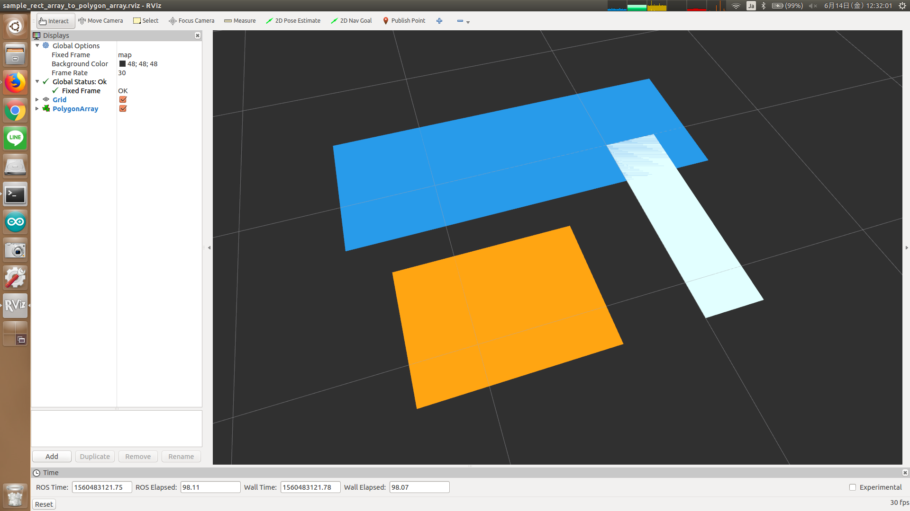

# rect_array_to_polygon_array.py



## What is this?

Convert `jsk_recognition_msgs/RectArray` to `jsk_recognition_msgs/PolygonArray`.


## Subscribing Topic

* `~input` (`jsk_recognition_msgs/RectArray`)

  Input rect array.


## Publishing Topic

* `~output` (`jsk_recognition_msgs/PolygonArray`)

  Output polygon array.


## Sample

```bash
roslaunch jsk_recognition_utils sample_rect_array_to_polygon_array.launch
```
