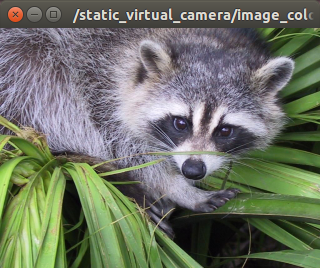

# static_virtual_camera.py



## What is this?

Publish static image and camera\_info topic.

You can use more convenience node [jsk_perception/image_publisher.py](../../jsk_perception/nodes/image_publisher.md)


## Publishing Topic

* `~image_color` (`sensor_msgs/Image`)

  Image topic.

* `~camera_info` (`sensor_msgs/CameraInfo`)

  Camera info topic.

## Sample

```bash
roslaunch jsk_recognition_utils sample_static_virtual_camera.launch
```
