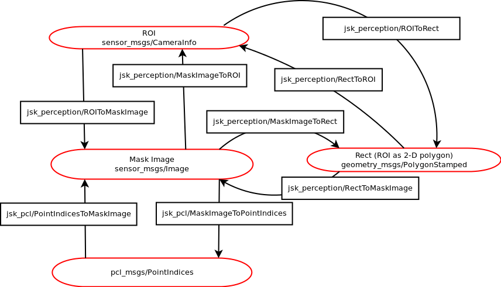

# Overview of jsk_recognition

## Representation of subset of image and pointcloud
jsk_recognition uses mask image, point indices and so on to
represent subset of image and pointcloud.
* Mask Image `sensor_msgs/Image`

  Mask image is a black and white image (encoded as MONO8) to represent
  subset of image.
* Label Image `sensor_msgs/Image`

  Label image is a image (encoded as TYPE_32FC1)
  to represent subsets of image.
* ROI `sensor_msgs/CameraInfo`

  ROI is an rectangular space of image.
  `roi` fields of `sensor_msgs/CameraInfo` is used to represent ROI.
* Rect `geometry_msgs/PolygonStamped`

  Rect is a 2-D polygonal region of image.
  `geometry_msgs/PolygonStamped` is originally designed for 3-D polygon, but
  in this case, it is used as 2-D polygon.
* Point Indices `pcl_msgs/PointIndices`

  Point indices represent subset of pointcloud.
* Cluster Point Indices `jsk_recognition_msgs/ClusterPointIndices`

  Cluster point indices is a set of point indices.

