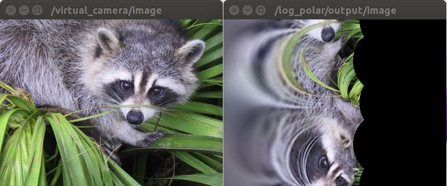

LogPolar
========

What is this?
-------------

Map input image to log polar space.

This function is an imitation of central vision of human.

Subscribing Topic
-----------------

- ``~input/image`` (``sensor_msgs/Image``)

  Input image.

- ``~input/camera_info`` (``sensor_msgs/CameraInfo``)

  Input camera info.

.. note::
   The subscribing topic name is changed when you remap the one of input image,
   because it uses `image_transport <http://wiki.ros.org/image_transport>`_.

Publishing Topic
----------------

- ``~output/image`` (``sensor_msgs/Image``)

  Log polar space image.

- ``~output/camera_info`` (``sensor_msgs/CameraInfo``)

  Output camera info.

Parameters
----------

- ``~inverse_log_polar`` (``Bool``, default: ``false``)

  Whether to apply inverse mapping.

- ``~log_polar_scale`` (``Float``, default: ``100.0``)

  Scaling coefficient.
  This parameter can be changed by ``dynamic_reconfigure``.

- ``~resize_scale_x``, ``~resize_scale_y`` (``Float``, default: ``1.0``)

  Resizing scale.
  This paramater can be changed by ``dynamic_reconfigure``.

- ``~msg_par_second`` (``Float``, default: ``15.0``)

  Topic publishing rate [Hz].
  This parameter can be changed by ``dynamic_reconfigure``.

- ``~verbose`` (``Bool``, default: ``false``)

  This parameter is not used.

Sample
------

::

    $ roslaunch resized_image_transport sample_log_polar.launch
