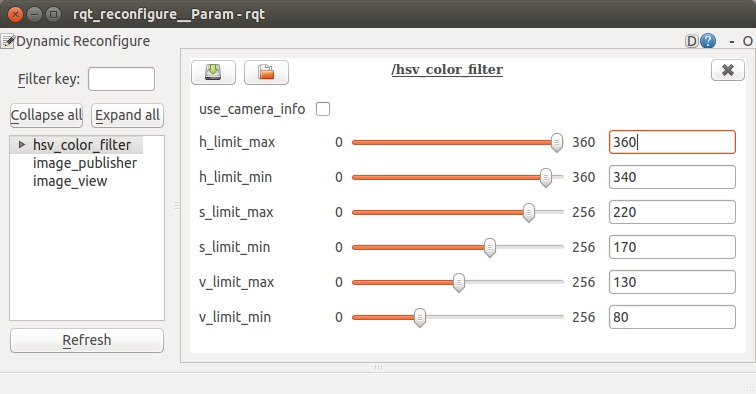
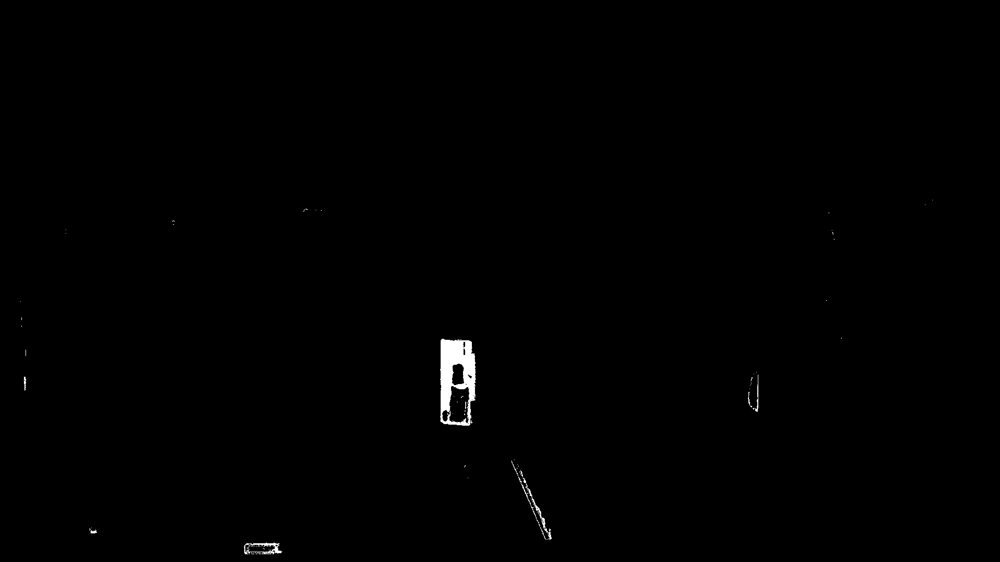

Find object with color filtering
================================

Introduction
------------

In this tutorial, we show a sample of finding object by color.

Step by step
------------

First, you need image topic, so please run ``tutorial_image_publisher.launch`` in
`previous tutorial <publish_static_image_topic.html>`_,
and below ``rostopic list`` output is expected:

.. code-block:: bash

  $ rostopic list
  /image_publisher/output
  /image_publisher/output/camera_info
  /image_publisher/parameter_descriptions
  /image_publisher/parameter_updates
  /image_view/output
  /image_view/parameter_descriptions
  /image_view/parameter_updates
  /rosout
  /rosout_agg

For color filtering, you can use `hsv_color_filter <http://wiki.ros.org/opencv_apps#hsv_color_filter>`_:

.. code-block:: bash

  $ rosrun opencv_apps hsv_color_filter image:=/image_publisher/output \
      _use_camera_info:=false __name:=hsv_color_filter
  $ rosrun image_view image_view image:=/hsv_color_filter/image

You can reconfigure rosparam using `rqt_reconfigure <http://wiki.ros.org/rqt_reconfigure>`_.

.. code-block:: bash

  rosrun rqt_reconfigure rqt_reconfigure

You can set parameters as below:

The result is like below:

.. image:: images/sample_image_publisher.jpg
   :width: 80%

A single command
----------------

You can run upper programs in a single command with writing file:

.. code:: bash

    $ vim tutorial_color_filtering.launch

Or you can download the file from:

    :download:`tutorial_color_filtering.launch <code/tutorial_color_filtering.launch>`

.. literalinclude:: code/tutorial_color_filtering.launch
   :language: xml

You can launch the roslaunch file by:

.. code:: bash

    $ roslaunch ./tutorial_color_filtering.launch
