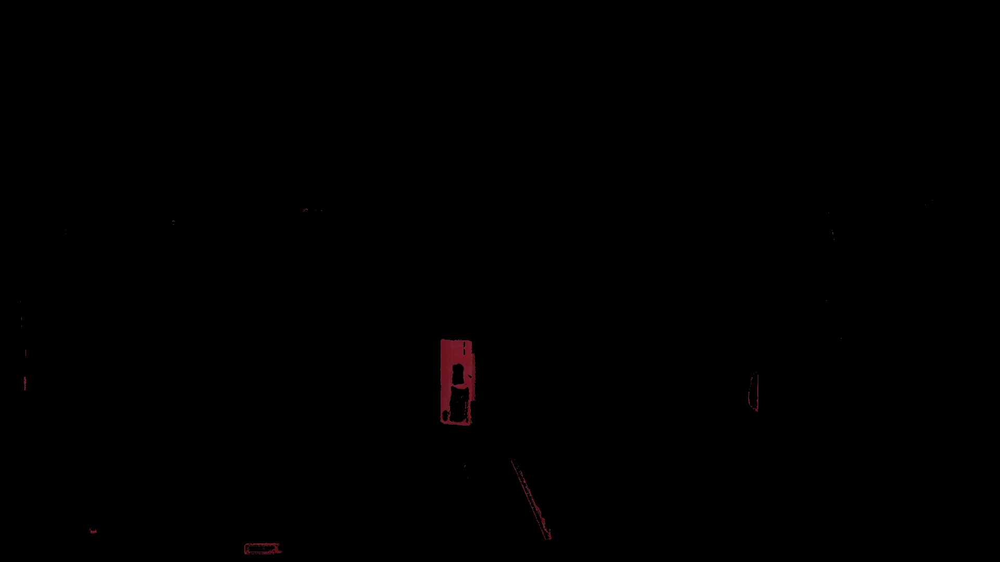

Get masked image
================

Introduction
------------

In `previous tutorial <find_object_with_color_filtering.html>`_,
we got object mask image of red box, and the next step is masking the color image using it.
We shows how to apply mask image to color image in this tutorial.

Step by step
------------

First, you need image topic, so please run ``tutorial_image_publisher.launch`` in
previous tutorials:
`Publish staic image topic <publish_static_image_topic.html>`_,
`Find object with color filtering <find_object_with_color_filtering.html>`_,
and below ``rostopic list`` output is expected:

.. code-block:: bash

  $ rostopic list
  /hsv_color_filter/image
  /hsv_color_filter/image/compressed
  /hsv_color_filter/image/compressed/parameter_descriptions
  /hsv_color_filter/image/compressed/parameter_updates
  /hsv_color_filter/image/compressedDepth
  /hsv_color_filter/image/compressedDepth/parameter_descriptions
  /hsv_color_filter/image/compressedDepth/parameter_updates
  /hsv_color_filter/image/theora
  /hsv_color_filter/image/theora/parameter_descriptions
  /hsv_color_filter/image/theora/parameter_updates
  /hsv_color_filter/parameter_descriptions
  /hsv_color_filter/parameter_updates
  /image_publisher/output
  /image_publisher/output/camera_info
  /image_publisher/parameter_descriptions
  /image_publisher/parameter_updates
  /image_view/output
  /image_view/parameter_descriptions
  /image_view/parameter_updates
  /rosout
  /rosout_agg

For this purpose, we can use `apply_mask_image <../jsk_perception/nodes/apply_mask_image.html>`_.
The advance from previous tutorials is it subscribes **2 topics**: color image and mask for processing.

.. code-block:: bash

  $ rosrun jsk_perception apply_mask_image
      _clip:=false _approximate_sync:=false _queue_size:=100 \
      \~input:=image_publisher/output \~input/mask:=hsv_color_filter/image

``_clip:=false`` is for disabling cropping of the region.
``_approximate_sync:=false`` and ``_queue_size:=...`` is for synchronization method of timestamp, that is needed if you subscribes
multiple topics. In this case, the both topic has the exactly the same stamp and it can be synchronized without approximation.
You can see the timestamp by below::

  $ rostopic echo /image_publisher/image/header/stamp
  $ rostopic echo /hsv_color_filter/image/header/stamp

The result will be like below:

Get better results
------------------

To get better results, you need some processing to the mask,
and below launch file includes the program:

Or you can download the file from:

    :download:`tutorial_get_masked_image.launch <code/tutorial_get_masked_image.launch>`

.. literalinclude:: code/tutorial_get_masked_image.launch
   :language: xml

You can launch the roslaunch file by:

.. code:: bash

    $ roslaunch ./tutorial_get_masked_image.launch

The result will be like below:

