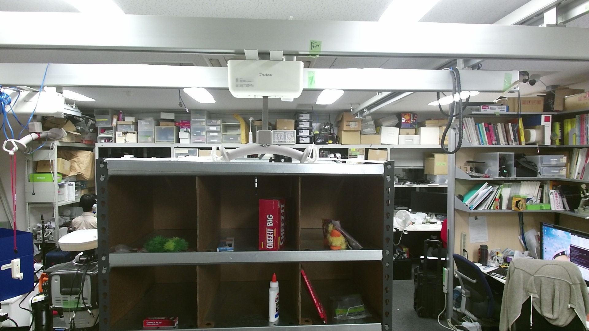

Publish static image topic
==========================

Introduction
------------

You may need image topics to try recognition nodes/nodelets in
jsk_perception, and this tutorial shows how to create image topic
easily.

Step by step
------------

For this purpose, you can use `image_publisher.py <../jsk_perception/nodes/image_publisher.html>`_.

terminal 1:

.. code:: bash

    $ roscore

terminal 2:

.. code:: bash

    $ rosrun jsk_perception image_publisher.py \
      _file_name:=$(rospack find jsk_perception)/sample/kiva_pod_image_color.jpg _rate:=30

``_file_name:=...`` and ``_rate:=...`` is remapping of **rosparam** and
you can get the value with:

.. code:: bash

    $ rosparam get /image_publisher/file_name
    /home/wkentaro/Projects/jsk/src/jsk-ros-pkg/jsk_recognition/jsk_perception/sample/kiva_pod_image_color.jpg

    $ rosparam get /image_publisher/rate
    30

The image is published to topic ``/image_publisher/output``, so you can
see it by:

.. code:: bash

    $ rosrun image_view image_view image:=/image_publisher/output

``image:=...`` is remaping of **topic**, and the ``image_view`` will
subscribe ``/image_publisher/output`` in this case.

The result is as shown below:

A single command
----------------

You can run upper programs in a single command with writing `roslaunch <http://wiki.ros.org/roslaunch>`_
file:

.. code:: bash

    $ # emacs tutorial_image_publisher.launch
    $ vim tutorial_image_publisher.launch

Or you can download the file from:

    :download:`tutorial_image_publisher.launch <code/tutorial_image_publisher.launch>`

.. literalinclude:: code/tutorial_image_publisher.launch
   :language: xml

You can launch the roslaunch file by:

.. code:: bash

    $ roslaunch ./tutorial_image_publisher.launch
