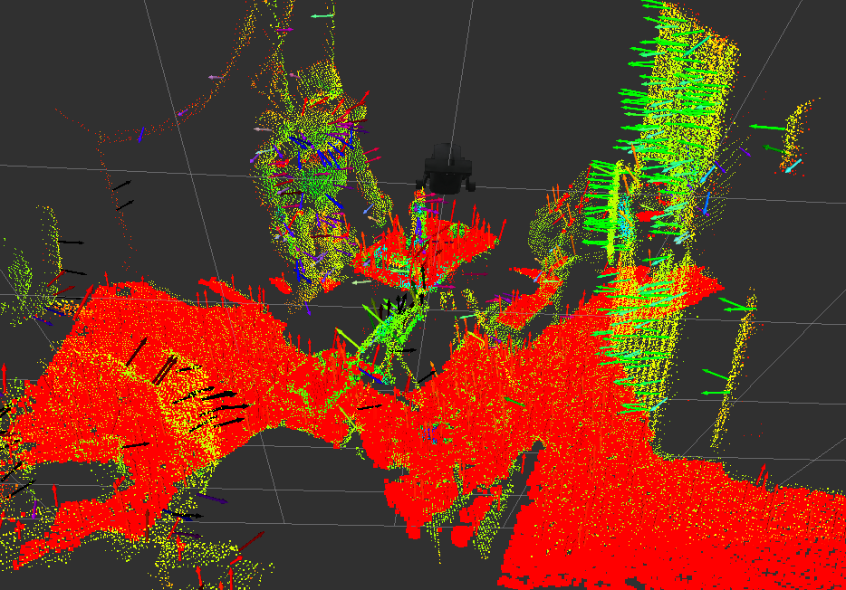

# jsk_pcl_ros

## Introduction
jsk\_pcl\_ros is a package to provide some programs using [pcl](http://pointclouds.org).

This package provides some programs as nodelet.

## types
jsk\_pcl\_ros provides several message types.
### ClusterPointIndices.msg
```
Header header
pcl_msgs/PointIndices[] cluster_indices
```
ClusterPointIndices is used to represent segmentation result.
Simply put, ClusterPointIndices is a list of PointIndices.

### ModelCoefficientsArray
```
Header header
pcl_msgs/ModelCoefficients[] coefficients
```
ModelCoefficientsArray is used to represent coefficients of model
for each segmented clusters.
Simply put, ModelCoefficientsArray is a list of ModelCoefficients.

### PolygonArray
```
Header header
geometry_msgs/PolygonStamped[] polygons
```
PolygonArray is a list of PolygonStamped.

You can use [jsk\_rviz\_plugins](https://github.com/jsk-ros-pkg/jsk_visualization) to visualize PolygonArray in rviz.

### BoundingBox
```
Header header
geometry_msgs/Pose pose
geometry_msgs/Vector3 dimensions #x, y and z
```
BoundingBox represent a oriented bounding box. `dimensions` mean the
size of bounding box.

### BoundingBoxArray
```
Header header
BoundingBox[] boxes
```
BoundingBoxArray is a list of BoundingBox.
You can use [jsk\_rviz\_plugins](https://github.com/jsk-ros-pkg/jsk_visualization) to visualize BoungingBoxArray in rviz.

### TimeRange
```
Header header
time start
time end
```
Represent range of time.

## nodelets
### jsk\_pcl/PolygonArrayAreaLikelihood
Compute likelihood based on area.
Near polygon is, larger likelihood is.
The likelihood is determined by `1/(1+d^2)` where `d` is difference between area and expected area.

#### Subscribing Topic
* `~input` (`jsk_recognition_msgs/PolygonArray`)

  Input polygon array.

#### Publishing Topic
* `~input` (`jsk_recognition_msgs/PolygonArray`)

  Input polygon array.

#### Parameters
* `~area` (default: `1.0`)

  Expected size of area of polygon.

### jsk\_pcl/PolygonArrayAngleLikelihood
Compute likelihood based on distance.
Near polygon is, larger likelihood is.
The likelihood is determined by `1/(1+d^2)` where `d` is a angular difference from `~target_frame_id` to the polygon.

#### Subscribing Topic
* `~input` (`jsk_recognition_msgs/PolygonArray`)

  Input polygon array.

#### Publishing Topic
* `~input` (`jsk_recognition_msgs/PolygonArray`)

  Input polygon array.

#### Parameters
* `~target_frame_id` (required)

  Frame id to compute polygon's distance from
* `~tf_queue_size`

  Queue size of tf message filter

### jsk\_pcl/PolygonArrayDistanceLikelihood
Compute likelihood based on distance.
Near polygon is, larger likelihood is.
The likelihood is determined by `1/(1+d^2)` where `d` is a distance from `~target_frame_id` to the polygon.

#### Subscribing Topic
* `~input` (`jsk_recognition_msgs/PolygonArray`)

  Input polygon array.

#### Publishing Topic
* `~input` (`jsk_recognition_msgs/PolygonArray`)

  Input polygon array.

#### Parameters
* `~target_frame_id` (required)

  Frame id to compute polygon's distance from
* `~tf_queue_size`

  Queue size of tf message filter

### jsk\_pcl/HeightmapConverter


Convert a pointcloud(`sensor_msgs/PointCloud2`) into heightmap representation (`sensor_msgs/Image`).

#### Subscribing Topic
* `~input` (`sensor_msgs/PointCloud2`)

  Input pointcloud

#### Publishing Topic
* `~output` (`sensor_msgs/Image`)

  fields of the image is `CV_32FC1(float)` and if a pixel is not observed, it is filled by `-FLT_MAX`.

* `~output/config` (`jsk_recognition_msgs/HeightmapConfig`)

  Config topic.
#### Parameters
* `~resolution_x` (Integer, default: `400`)
* `~resolution_y` (Integer, default: `400`)

  Resolution of height map

* `~min_x` (Double, default: `-2.0`)
* `~max_x` (Double, default: `2.0`)
* `~min_y` (Double, default: `-2.0`)
* `~max_y` (Double, default: `2.0`)

  Minimum and maximum value of heightmap dimension.

### jsk\_pcl/HeightmapToPointCloud


Convert a heightmapt to poincloud.

#### Subscribing Topic
* `~input` (`sensor_msgs/Image`)

  Input heightmap.
* `~input/config` (`jsk_recognition_msgs/HeightmapConfig`)

  Config topic.

#### Publishing Topic
* `~output` (`sensor_msgs/PointCloud2`)

  Output pointcloud.

* `~output/config` (`jsk_recognition_msgs/HeightmapConfig`)

  Config topic.
### jsk\_pcl/HeightmapMorphologicalFiltering


Apply morphological fintering and average filter to fill small holes in pointcloud
which is represented as heightmap.

#### Subscribing Topic
* `~input` (`sensor_msgs/Image`)

  Input heightmap. Hole should be represented as `-FLT_MAX` or `nan`.
* `~output/config` (`jsk_recognition_msgs/HeightmapConfig`)

  Config topic.

#### Publishing Topic
* `~output` (`sensor_msgs/Image`)

  Output heightmap.

#### Parameters
* `~max_queue_size` (Integer, default: `10`):

  Max queue size of subscription callback.
* `~mask_size` (Integer, default: `2`):

  Size of kernel operator of average filtering.
* `~max_variance` (Double, default: `0.1`):

  Allowable max variance in kernel operator

### jsk\_pcl/HeightmapTimeAccumulation


Accumulate heightmap in time series and construct a new heightmap.

#### Subscription Topic
* `~input` (`sensor_msgs/Image`)

  Input new heightmap(t=k).
* `~input/prev_pointcloud` (`sensor_msgs/PointCloud2`)

  Accumulated heightmap represented in pointcloud from 0 to k-1 step.
* `~input/config` (`jsk_recognition_msgs/HeightmapConfig`)

  Config topic.

#### Publishing Topic
* `~output` (`sensor_msgs/Image`)

  Accumulated heightmap.

* `~output/config` (`jsk_recognition_msgs/HeightmapConfig`)

  Config topic.

#### Advertising Service
* `~seset` (`std_srvs/Empty`)

  Reset heightmap cache.

### jsk\_pcl/NormalEstimationOMP
This nodelet is almost same to `pcl/NormalEstimationOMP` of `pcl_ros` package,
but it can handle timestamp correctly.

#### Subscribing Topic
* `~input` (`sensor_msgs/PointCloud2`)

  Input pointcloud.

#### Publishing Topic
* `~output` (`sensor_msgs/PointCloud2`)

  Output pointcloud, point type is `pcl::Normal`.
* `~output_with_xyz` (`sensor_msgs/PointCloud2`)

  Output pointcloud, point type is `pcl::XYZRGBNormal`.

#### Parameters
* `~k_search`

  K search parameter for normal estimation
* `~radius_search`

  Radius search parameter for normal estimation

### jsk\_pcl/PointCloudLocalization


Localize 6d pose of robot using ICP registration of pointcloud.
It publishes tf transformation from gloabl frame to odometory frame like acml does.

#### Subscribing Topic
* `~input` (`sensor_msgs/PointCloud2`)

  Input pointcloud to align.

#### Publishing Topic
* `~output` (`sensor_msgs/PointCloud2`)

  Concatenated pointcloud.

#### Parameters
* `~tf_rate` (Double, default: `20.0`)

  Frequency to publish tf transformations.
* `~cloud_rate` (Double, default: `10.0`)

  Frequency to publish `~output` topic.
* `~leaf_size` (Double, default: `0.01`)

  Resolution of voxel grid downsampling.
* `~use_normal` (Bool, default: `false`)

  Support normal.

#### Using Services
* `~icp_align` (`jsk_pcl_ros/ICPAlign`)

  ICP service to align pointcloud

#### Advertising Services
* `~localize` (`std_srvs/Empty`)

  Run localization
* `~update_offset` (`jsk_pcl_ros/UpdateOffset`)

  Update transformation between odom frame and global frame manuaaly.
  Currently no tf is resolved.

### jsk\_pcl/UniformSampling
Sample pointloud in the manner of uniform sampling.

#### Subscribing Topic
* `~input` (`sensor_msgs/PointCloud2`)

  Input pointcloud

#### Publishing Topic
* `~output` (`pcl_msgs/PointIndices`)

  Sampled indices

#### Parameters
* `~search_radius` (Double, default: `0.01`)

  Sampling radius to apply uniform samplng.

### jsk\_pcl/FeatureRegistration
Align pointcloud using 3d feature. Currently only FPFH is supported.

#### Subscribing Topic
* `~input` (`sensor_msgs/PointCloud2`)

   Input pointcloud. The type of point is `pcl::PointNormal`.
* `~input/feature` (`sensor_msgs/PointCloud2`)

   Input feature. The type of point is `pcl::FPFHSignature33`.
* `~input/reference/cloud` (`sensor_msgs/PointCloud2`)

   Reference pointcloud. The type of point is `pcl::PointNormal`.
* `~input/reference/feature` (`sensor_msgs/PointCloud2`)

   Reference feature. The type of point is `pcl::FPFHSignature33`.

#### Publishing Topic
* `~output` (`geometry_msgs/PoseStamped`)

  Transformation to align reference cloud to input cloud.
* `~output/cloud` (`sensor_msgs/PointCloud`)

  Reference pointCloud which is aligned to input cloud.

#### Parameters
* `~max_iterations` (Integer, default: `1000`)

  Maximum number of iterations.
* `~correspondence_randomness` (Integer, default: `2`)

  Number of nearest features to use
* `~similarity_threshold` (Double, default: `0.9`)

  Polygonal edge length similarity threshold
* `~max_correspondence_distance` (Double, default: `0.0075`)

  inlier threshold
* `~inlier_fraction` (Double, default: `0.25`)

  inlier fraction

### jsk\_pcl/GeometricConsistencyGrouping
Estimate model position using Geometric Consisteny Grouping technique

#### Subscribing Topic
* `~input` (`sensor_msgs/PointCloud2`)

  Scene pointcloud. The type is `pcl::PointNormal`.
* `~input/feature` (`sensor_msgs/PointCloud2`)

  Scene feature. currently SHOT352 is supported.

* `~input/reference` (`sensor_msgs/PointCloud2`)

  Model pointcloud. The type is `pcl::PointNormal`.
* `~input/reference/feature` (`sensor_msgs/PointCloud2`)

  Model feature. currently SHOT352 is supported.

#### Publishing Topic
* `~output` (`geometry_msgs/PoseStamped`)

  Pose of recognized object

#### Parameters
* `~gc_size` (Double, default: `0.01`)

  Size of cluster
* `~gc_thresh` (Double, default: `5.0`)

  Threshold of clustering

### jsk\_pcl/BorderEstimator


Convert pointcloud into range image and detect border

#### Subscribing Topic
* `~input` (`sensor_msgs/PointCloud2`)

  Input pointcloud

* `~input_camera_info` (`sensor_msgs/CameraInfo`)

  Camera info is used to reconstruct organized range image
  when `~model_type` is `planar`

#### Publishing Topic
* `~output_cloud` (`sensor_msgs/PointCloud`)

  Pointcloud converted as range image. If `~model_type` is `planar`, it should be
  equal to original organized pointcloud, When `~model_type` is `laser`,
  original pointcloud and `~output_cloud` is not same.

* `~output_border_indices` (`pcl_msgs/PointIndices`)

  Indices of border

* `~output_veil_indices` (`pcl_msgs/PointIndices`)

  Indices of veil points

* `~output_shadow_indices` (`pcl_msgs/PointIndices`)

  Indices of shadow edge

* `ourput_range_image` (`sensor_msgs/Image`)

  Range image

#### Parameters
* `~model_type` (String, default: `planar`)

  Choose model type of range image by this topic. `planar`, `laser` or `sphere` is
  allowed.

* `~angular_resolution` (Double, default: `-0.5`)

  Angular resolution of range image. Only does `laser` model use this parameter.

* `~noise_level` (Double, default: `0.1`)

  Noise level of pointcloud. Only does `laser` model use this parameter.
* `~min_range` (Double, default: `0.0`)

  Minimam distance to take into account range image. Only does `laser` model use this parameter.
* `~border_size` (Integer, default: `0`)

  Border size to remove from range image.
* `~max_angle_height` (Double, default: `2pi`)

  Maximum angle height of range image. Only does `laser` model use this parameter.
* `~max_angle_width` (Double, default: `2pi`)
  Maximum angle width of range image. Only does `laser` model use this parameter.

### jsk\_pcl/PointCloudToClusterPointIndices
Just convert pointcloud to `jsk_recognition_msgs/ClusterPointIndices`.
This nodelet is useful to compute bounding box of pointcloud by ClusterPointIndicesDecomposer.

#### Subscribing Topic
* `~input` (`sensor_msgs/PointCloud2`)

  Input pointcloud

#### Publishing Topic
* `~output` (`jsk_recognition_msgs/ClusterPointIndices`)

  Output cluster indices.

### jsk\_pcl/HintedHandleEstimator


Detect a handle grasp pose from pointcloud and point as hint.

#### Subscribing Topic
* `~cloud` (`sensor_msgs/PointCloud2`)

  Input pointcloud

* `~point` (`geometry_msgs/PointStamped`)

  3D Point (You can get from rviz "Publish Point" or image_view2)

#### Publishing Topic
* `handle_pose` (`geometry_msgs::PoseStamped`)

  estimated handle pose

* `handle_length` (`std_msgs::Float64`)

  estimated handle length

* `debug_marker` (`visualization_msgs::Marker`)

  the result of calculating handle direction

* `debug_marker_array` (`visualization_msg::MarkerArray`)

  estimated handle visualization

#### Parameters


* `~finger_l` (Float, default: `0.03`)
* `~finger_w` (Float, default: `0.01`)
* `~finger_d` (Float, default: `0.02`)
* `~arm_l` (Float, default: `0.05`)
* `~arm_w` (Float, default: `0.1`)
* `~arm_d` (Float, default: `0.01`)


### jsk\_pcl/HintedStickFinder


Detect a stick from pointcloud and line in 2-D image as hiint.

#### Subscribing Topic
* `~input` (`sensor_msgs/PointCloud2`)

  Input pointcloud

* `~input/camera_info` (`sensor_msgs/CameraInfo`)

  Camera parameter where hint line is defined

* `~input/hint/line` (`geometry_msgs/PolygonStamped`)

  Hint line described in 2-D image.

#### Publishing Topic
* `~debug/line_filtered_indices` (`pcl_msgs/PointIndices`)

  Indices of input pointcloud which is filtered by hint line.

* `~debug/line_filtered_normal` (`sensor_msgs/PointCloud`)

  Normal pointcloud of filtered pointcloud.

* `~debug/cylinder_marker` (`visualization_marker/Marker`)

  Marker topic to visualize detected stick

* `~debug/cylinder_pose` (`geometry_msgs/PoseStamped`)

  Pose of detected stick.

* `~output/inliers` (`pcl_msgs/PointIndices`)

  Inliers of detected stick.
* `~output/coefficients` (`pcl_msgs/ModelCoefficients`)

  Coefficients of detected stick. The coefficients are
  `[cx, cy, cz, dx, dy, dz, r, h]`.

#### Parameters
* `~min_radis` (Double, default: `0.05`)
* `~max_radis` (Double, default: `0.2`)

  Minium and maximum radius of cylinder fitting.

* `~filter_distance` (Double, default: `0.2`)

  Distance from hint line to points which cna be candidate.

* `~outlier_threshold` (Double, default: `0.01`)

  Outlier threshold in cylinder fitting.

* `~max_iteration` (Integer, default: `100`)

  Maximum number of iteraoitn in cylinder fitting

* `~min_probability` (Integer, default: `0.8`)

  Required minimum probability of cylinder fitting

* `~cylinder_fitting_trial` (Integer, default: `3`)

  The number of cylinder fitting trials when no cylinder is found

* `~min_inliers` (Integer, default: `10`)

  Minimum number of inliers in cylinder fitting.

* `~eps_2d_angle` (Double, default: `0.1`)

  Threshold between hint line and detected stick. This evaluation is done in 2-D coordinate system.

* `~not_synchronize` (Boolean, default: `False`)

  Do not synchronize `~input`, `~input/camera_info` and `~input/hint/line` if this parameter is `True`.
  `~input/camera_info` and `~input/hint/line` are stored in nodelet and latest of the messages are used for new `~input` pointcloud.
* `~use_normal` (Boolean, default: `False`)

  Do not run normal estimation inside of the nodelet and use normal fields of `~input` are used.

### jsk\_pcl/RGBColorFilter
Filter pointcloud based on RGB range.

#### Subscribing Topic
* `~input` (`sensor_msgs/PointCloud2`)

  Input pointcloud. rgb field is required.

* `~indices` (`pcl_msgs/PointIndices`)

  Indices of pointcloud. only available if `~use_indices` is true.

#### Publishing Topic
* `~output` (`sensor_msgs/PointCloud2`)

  Filtered pointcloud.

#### Parameters
* `~r_max` (Integer, default: `255`)
* `~r_min` (Integer, default: `0`)
* `~g_max` (Integer, default: `255`)
* `~g_min` (Integer, default: `0`)
* `~b_max` (Integer, default: `255`)
* `~b_min` (Integer, default: `0`)

  Color range to filter.

### jsk\_pcl/HSIColorFilter


Filter pointcloud based on HSI range.

#### Subscribing Topic
* `~input` (`sensor_msgs/PointCloud2`)

  Input pointcloud. rgb field is required.

* `~indices` (`pcl_msgs/PointIndices`)

  Indices of pointcloud. only available if `~use_indices` is true.

#### Publishing Topic
* `~output` (`sensor_msgs/PointCloud2`)

  Filtered pointcloud.

#### Parameters
* `~h_max` (Integer, default: `127`)
* `~h_min` (Integer, default: `-128`)
* `~s_max` (Integer, default: `255`)
* `~s_min` (Integer, default: `0`)
* `~i_max` (Integer, default: `255`)
* `~i_min` (Integer, default: `0`)

   Color range to filter.

### jsk\_pcl/AddPointIndices
add two different `pcl_msgs/PointIndices` into one indices.

#### Subscribing Topic
* `~input/src1` (`pcl_msgs/PointIndices`)
* `~input/src2` (`pcl_msgs/PointIndices`)

  Input indices

#### Publishing Topic
* `~output` (`pcl_msgs/PointIndices`)

  Output indices

#### Parameters
* `approximate_sync` (Boolean, default: `false`)

  If this parameter is true, `~input/src1` and `~input/src2` are synchronized with
  approximate time policy.

### jsk\_pcl/MaskImageFilter


Extract indices of pointcloud which is masked by mask image. The pointcloud is no need to be organized.

#### Subscribing Topic
* `~input` (`sensor_msgs/PointCloud2`)

  Input point cloud.
* `~input/mask` (`sensor_msgs/Image`)

  Mask image.
* `~input/camera_info` (`sensor_msgs/CameraInfo`)

  Camera parameters of the image.

#### Publishing Topic
* `~output` (`pcl_msgs/PointIndices`)

  Indices of the points masked by `~input/mask`.


### jsk\_pcl/MaskImageClusterFilter


Segment Clouds with mask_image and Clustering Methods(example. SuperVoxel).

#### Subscribing Topic
* `~input` (`sensor_msgs/PointCloud2`)

  Input point cloud.
* `~target` (`jsk_recognition_msgs/ClusterPointIndices`)

  Result of Some Clustering methods
* `~input/mask` (`sensor_msgs/Image`)

  Mask image.
* `~input/camera_info` (`sensor_msgs/CameraInfo`)

  Camera parameters of the image.

#### Publishing Topic
* `~output` (`pcl_msgs/PointIndices`)

  Indices of the points masked with `~input/mask` and '~target'.

### jsk\_pcl/TorusFInder


Find a torus out of pointcloud based on RANSAC with 3-D circle model.

#### Subscribing Topic
* `~input` (`sensor_msgs/PointCloud`)

  Input pointcloud. You may need to choose good candidates of pointcloud.
* `~input/polygon` (`geometry_msgs/PolygonStampedd`)

  Input polygon. You can use `geometry_msgs/PolygonStampedd` instead of `sensor_msgs/PointCloud`

#### Publishing Topic

* `~output` (`jsk_recognition_msgs/Torus`)

  Output of detection.

* `~output/inliers` (`pcl_msgs/PointIndices`)
* `~output/coefficients` (`pcl_msgs/ModelCoefficients`)

  Inliers and coefficients which represents detection result.
* `~output/array` (`jsk_recognition_msgs/TorusArray`)

  Array of torus. It will be used for visualization.

* `~output/posie` (`geometry_msgs/PoseStamped`)

  Publish result of detection as `geometry_msgs/PoseStamped`

#### Parameters
* `~min_radius` (Double, default: `0.1`)
* `~max_radius` (Double, default: `1.0`)

  Minimum and maximum radius of torus.
* `~min_size` (Integer, default: `10`)

  Minimum number of inliers.
* `~outlier_threshold` (Double, default: `0.01`)

  Outlier threshold used in RANSAC.
* `~max_iterations` (Integer, default: `100`)

  Maximum number of iterations of RANSAC.

### jsk\_pcl/AddColorFromImage


Add color to pointcloud (no need to be organized) from image and camera info.

### Subscribing Topic
* `~input` (`sensor_msgs/PointCloud`)

  Input point cloud to add color. No need to be an organized pointcloud.
* `~input/image` (`sensor_msgs/Image`)

  BGR8 color image.
* `~input/camera_info` (`sensor_msgs/CameraInfo`)

  Camera parameters of `~input/image`

### Publishing Topic
* `~output` (`sensor_msgs/PointCloud`)

  Output colored pointcloud.

### jsk\_pcl/PlaneConcatenator


Concatenate near planes and build new set of planes.

#### Subscribing Topic
* `~input` (`sensor_msgs/PointCloud2`)

  Input pointcloud.
* `~input/indices` (`jsk_recognition_msgs/ClusterPointIndices`)
* `~input/polygons` (`jsk_recognition_msgs/PolygonArray`)
* `~input/coefficients` (`jsk_recognition_msgs/ModelCoefficientsArray`)
  Input planes.

#### Publishing Topics
* `~output/indices` (`jsk_recognition_msgs/ClusterPointIndices`)
* `~output/polygons` (`jsk_recognition_msgs/PolygonArray`)
* `~output/coefficients` (`jsk_recognition_msgs/ModelCoefficientsArray`)
  Concatenated planes. Coefficients parameters are refined by RANSAC.

#### Parameters
* `~connect_angular_threshold` (Double, default: `0.1`)

   Angular threshold to regard two planes as near.
* `~connect_distance_threshold` (Double, default: `0.1`)

   Euclidean distance threshold to regard two planes as near.
* `~connect_perpendicular_distance_threshold` (Double, default: `0.1`)

   Distance threshold to connect two planes in perpendicular direction.
* `~ransac_refinement_max_iteration` (Integer, default: `100`)

  The maximum number of iteration of RANSAC refinement.
* `~ransac_refinement_outlier_threshold` (Double, default: `0.1`)

  Outlier threshold of RANSAC refinmenet.
* `~ransac_refinement_eps_angle` (Double, default: `0.1`)

  Eps angle threshold of RANSAC refinment using normal direction of the plane.

### jsk\_pcl/PolygonMagnifier
Magnify polygons by specified length.

#### Subscribing Topic
* `~input` (`jsk_recognition_msgs/PolygonArray`)

  Input polygons

#### Publishing Topic
* `~output` (`jsk_recognition_msgs/PolygonArray`)

  Output magnified polygons

#### Parameters
* `~magnify_distance` (Double, default: `0.2`)

  Length to scale polygon

### jsk\_pcl/PolygonPointsFlipper

Flip `jsk_recognition_msgs/PolygonArray` to specified sensor_frame.

#### Subscribing Topic
* `~input/polygons` (`jsk_recognition_msgs/PolygonArray`)
* `~input/coefficients` (`jsk_recognition_msgs/ModelCoefficientsArray`)

  Input polygons.
#### Publishing Topic
* `~output/polygons` (`jsk_recognition_msgs/PolygonArray`)
* `~output/coefficients` (`jsk_recognition_msgs/ModelCoefficientsArray`)

  Output flipped polygons which look at the origin of sensor_frame.
#### Parameter
* `~sensor_frame` (String)

   frame_id of sensor for polygons to look at.

### jsk\_pcl/PolygonPointsSampler


Sampling points with fixed grid size on polygons.

#### Subscribing Topic
* `~input/polygons` (`jsk_recognition_msgs/PolygonArray`)
* `~input/coefficients` (`jsk_recognition_msgs/ModelCoefficientsArray`)
  Input polygons where be sampled

#### Publishing Topic
* `~output` (`sensor_msgs/PointCloud2`)

  Sampled pointcloud (`pcl::PointXYZRGBNormal`).
* `~output_xyz` (`sensor_msgs/PointCloud2`)

  Sampled pointcloud (`pcl::PointXYZ`).

#### Parameters
* `~grid_size` (Double, default: `0.01`)

  Sampling grid size.
### jsk\_pcl/SupervoxelSegmentation


Segment pointcloud based on Supervoxel technique.
see Voxel Cloud Connectivity Segmentation - Supervoxels for Point Clouds (J. Papon et al. CVPR2013).
#### Subscribing Topic
* `~input` (`sensor_msgs/PointCloud2`)

  Input pointcloud. It should have rgb field.

#### Publishing Topic
* `~output/cloud` (`sensor_msgs/PointCloud2`)

  Output pointcloud downsampled by voxel grid.

* `~output/indices` (`jsk_recognition_msgs/ClusterPointIndices`)

  Clustering result.

#### Parameters
* `~color_importance` (`Double`, default: `0.2`)

  Color importance factor.
* `~spatial_importance` (`Double`, default: `0.4`)

  Spatial importance factor.
* `~normal_importance` (`Double`, default: `1.0`)

  Normal importance factor.
* `~use_transform` (`Boolean`, default: `True`)

  Use single cloud transform
* `~seed_resolution` (`Double`, default: `0.1`)

  Seed resolution of super voxels.
* `~voxel_resolution` (`Double`, default: `0.008`)

  Voxel grid resolution of super voxels.

### jsk\_pcl/IncrementalModelRegistration
#### What Is This


Build a full-model from sequential captured data.

#### Subscribing Topic
* `~input` (`sensor_msgs/PointCloud2`)

  Input pointcloud. RGB field is required.
* `~input/pose` (`geometry_msgs/PoseStamped`)

  Initial pose to estimate acculate pose of the pointcloud.
* `~input/indices` (`pcl_msgs/PointIndices`)

  Indices to mask object in `~input` pointcloud.

#### Publishing Topic
* `~output/non_registered` (`sensor_msgs/PointCloud2`)

  Pointcloud just concatenated according to `~input/pose`

* `~output/registered` (`sensor_msgs/PointCloud2`)

  Pointcloud refined by ICP.
#### Using Services
* `~icp_service` (`jsk_pcl_ros/ICPAlign`)

  ICP service interface to refine model.

### jsk\_pcl/IntermittentImageAnnotator
#### What Is This


1. Store images when `~shutter` service is called
2. Publish snapshots as one concatenated image
3. Subscribe `~output/screenrectangle` to get ROI.
4. Publish ROI information to `~output` namespace.
5. Publish pointcloud inside of the ROI to `~output/cloud` if `~store_pointcloud` is set

#### Subscribing Topic
* `~input/image` and `~input/camera_info` (`sensor_msgs/Image` and `sensor_msgs/CameraInfo`)

  Input image and camera info.

* `~input/cloud` (`sensor_msgs/PointCloud2`)

  Input pointcloud to be clipped by specified ROI.

* `~output/screenrectangle` (`geometry_msgs/PolygonStamped`)

  ROI. We expect to use [image_view2](https://github.com/jsk-ros-pkg/jsk_common/tree/master/jsk_ros_patch/image_view2).

#### Publishing Topic
* `~output` (`sensor_msgs/Image`)

  Snapshots as one concatenated image.

* `~output/direction` (`geometry_msgs/PoseStamped`)

  Direction of ROI as `PoseStamped`. z-axis directs the center of ROI.

* `~output/roi` (`jsk_recognition_msgs/PosedCameraInfo`)

  Publish ROI of specified region as `PosedCameraInfo`.

* `~output/cloud` (`sensor_msgs/PointCloud`)

  Pointcloud inside of ROI. pointcloud is stored when `~shutter` service is called and
  its timestamp will be updated according to the latest image.

* `~output/marker` (`visualization_msgs/Marker`)

  Marker to visualize ROI (`~output/roi`).
#### Parameters
* `~fixed_frame_id` (`String`, default: `odom`)

  Fixed frame id to resolve tf.

* `~max_image_buffer` (`Integer`, default: `5`)

  The maximum number of images to store in this nodelet.

* `~store_pointcloud` (`Boolean`, default: `false`)

  Store pointcloud if it's true

* `~keep_organized` (`Boolean`, default: `false`)

  Keep pointcloud organized after clipping by specified ROI.

#### Advertising Service

* `~shutter` (`std_srvs/Empty`)

  Take a snapshot

* `~clear` (`std_srvs/Empty`)

  Clear images stored in the nodelet.

### jsk\_pcl/LINEMODDetector
#### What Is This


A nodelet to detect object using LINEMOD.

#### Subscribing Topic
* `~input` (`sensor_msgs/PointCloud2`)

  Input pointcloud.

#### Publishing Topic
* `~output` (`sensor_msgs/PointCloud2`)

  Result of detection as pointcloud.

* `~output/mask` (`sensor_msgs/Image`)

  Result of detection as mask image.

* `~output/pose` (`geometry_msgs/PoseStamped`)

  Pose of detected template

* `~output/template` (`sensor_msgs/PointCloud2`)

  Template pointcloud at identity pose.

#### Parameters
* `~template_file` (`String`, default: `template`)

  Template file
* `~gradient_magnitude_threshold` (`Double`, default: `10.0`)

  Gradient maginutude threshold

* `~detection_threshold` (`Double`, default: `0.75`)

  Detection threshold

### jsk\_pcl/LINEMODTrainer
#### What Is This


A nodelet to train LINEMOD data from pointcloud and indices to mask the objects.
This nodelet stores data of pointcloud and if you call `~start_training` service,
it will train the data and dump the templates into lmt file.

#### Subscribing Topic
* `~input` (`sensor_msgs/PointCloud2`)

  This pointcloud should be able to be converted into `pcl::PointXYZRGBA` data.
* `~input/indices` (`pcl_msgs/PointIndices`)

  Indices to mask object in `~input` pointcloud.

* `~input/info` (`sensor_msgs/CameraInfo`)

  Camera parameter to sample viewpoint.

#### Publishing Topic
* `~output/range_image` (`sensor_msgs/Image`)
* `~output/colored_range_image` (`sensor_msgs/Image`)
* `~output/sample_cloud` (`sensor_msgs/PointCloud2`)

  Image and pointcloud generated by viewpoint sampling.

#### Advertising Servicies
* `~start_training` (`std_srvs/Empty`)

  Start training and dump result into a file.

* `~clear_data` (`std_srvs/Empty`)

  Clear stored data.
#### Parameters
* `~output_file` (`String`, default: `template`)

   A file path to dump trained data.

* `~sample_viewpoint` (`Bool`, default: `True`)

  Generate training data by samplingenerating viewpoint if this parameter is set to true.

* `~sample_viewpoint_angle_step` (`Double`, default: `40.0`)
* `~sample_viewpoint_angle_min` (`Double`, default: `-80.0`)
* `~sample_viewpoint_angle_max` (`Double`, default: `80.0`)
* `~sample_viewpoint_radius_step` (`Double`, default: `0.2`)
* `~sample_viewpoint_radius_min` (`Double`, default: `0.4`)
* `~sample_viewpoint_radius_max` (`Double`, default: `0.8`)

  Viewpoint sampling parameters. Pose of model is sampled by golden ratio spatial technique.

### jsk\_pcl/CaptureStereoSynchronizer
#### What Is This


A nodelet to capture training data of stereo cameras. It subscribe several messages with
synchronizing timestamp and republish them into `~output` namespace.

#### Subscribing Topic
* `~input/pose` (`geometry_msgs/PoseStamped`)

  Pose of checkerboard

* `~input/mask` (`sensor_msgs/Image`)

  Mask image of the object

* `~input/mask_indices` (`pcl_msgs/PointIndices`)

  Pointcloud indices of the object

* `~input/left_image` (`sensor_msgs/Image`)

  Left camera image

* `~input/left_camera_info` (`sensor_msgs/CameraInfo`)

  Left camera parameter

* `~input/right_camera_info` (`sensor_msgs/CameraInfo`)

  Right camera parameter

* `~input/disparity` (`stereo_msgs/Disparity`)

  Disparity image of the stereo camear.

#### Publishing Topic
* `~output/pose` (`geometry_msgs/PoseStamped`)
* `~output/mask` (`sensor_msgs/Image`)
* `~output/mask_indices` (`pcl_msgs/PointIndices`)
* `~output/left_image` (`sensor_msgs/Image`)
* `~output/left_camera_info` (`sensor_msgs/CameraInfo`)
* `~output/right_camera_info` (`sensor_msgs/CameraInfo`)
* `~output/disparity` (`stereo_msgs/Disparity`)

  These topics are the same message to the `~input/foo` messages but all of them
  are republished only if input messages are synchronized.

#### Sample
Please check [capture_multisense_training_data.launch](launch/capture_multisense_training_data.launch).

### jsk\_pcl/MaskImageToPointIndices
A nodelet to convert mask image (`sensor_msgs::Image`) to `pcl_msgs/PointIndices` for
organized pointcloud.

#### Subscribing Topic
* `~input` (`sensor_msgs/Image`)

  Input mask image.

#### Publishing Topic
* `~output` (`pcl_msgs/PointIndices`)

  Output indices converted from the mask image.

### jsk\_pcl/OrganizedPointCloudToPointIndices
A nodelet to convert organized PointCloud (`sensor_msgs::PointCloud2`) to `pcl_msgs/PointIndices` for
organized pointcloud.

#### Subscribing Topic
* `~input` (`sensor_msgs/PointCloud2`)

  Input organized pointcloud.

#### Publishing Topic
* `~output` (`pcl_msgs/PointIndices`)

  Output indices converted from the organized pointcloud.

### jsk\_pcl/PointIndicesToMaskImage
#### What Is This


jsk\_pcl/PointIndicesToMaskImage generates mask image from `pcl_msgs/PointIndices`
of organized pointcloud and original `sensor_msgs/Image`.

#### Subscribing Topic
* `~input` (`pcl_msgs/PointIndices`)

   Indices of the point cloud to mask.

* `~input/image` (`sensor_msgs/Image`)

   In order to know width and height of the original image, jsk\_pcl/PointIndicesToMaskImage requires
   input image.

#### Publishing Topic

* `~output `(`sensor_msg/Image`)


   Mask image to get `~input` indices from the origina limage.

### jsk\_pcl/MaskImageToDepthConsideredMaskImage
#### What Is This


jsk_pcl/MaskImageToDepthConsideredMaskImage extracts directed area of mask image in the order of depth from `sensor_msgs/PointCloud2` and `sensor_msgs/Image` of mask image. Example is at jsk_pcl_ros/launch/extract_only_directed_region_of_close_mask_image.launch .

#### Subscribing Topic

* `~input` (`sensor_msgs/PointCloud2`)

  Depth information of image. Width and height of this data must be same with ~input/image.

* `~input/image` (`sensor_msgs/Image`)

  Input mask image.

* `~input/maskregion` (`sensor_msgs/Image`)

  Input mask region.(To use interactively, use interaction_mode:grabcut_rect of image_view2.)

#### Publishing Topic

* `~output `(`sensor_msg/Image`)

  Output mask Image.  Points at close range is extracted.

#### Parameter

* `~extract_num (Int, default: `500`)

  Num of extract points in mask image.

* `~use_mask_region (Bool, default: True)

  Whether use msk region option or not. If true, only selected region of mask image is extracted.

### jsk\_pcl/AttentionClipper
#### What Is This


It retrives `sensor_msgs/CameraInfo` and publish `sensor_msgs/CameraInfo` with ROI filled and
retirieves `sensor_msgs/PointCloud2` and publish `pcl_msgs/PointIndices`.

You can specify the pose and size of the interest bounding box and jsk\_pcl/AttentionClipper returns ROI
to see the object.

#### Subscribing Topic
* `~input` (`sensor_msgs/CameraInfo`)

  Original camera info.

* `~input/points` (`sensor_msgs/PointCloud2`)

  Original pointcloud.
* `~input/pose` (`geometry_msgs/PoseStamped`)
* `~input/box` (`jsk_recognition_msgs/BoundingBox`)
  Specify the pose of the bounding box. Timestamp will be ignored and camera info's timestamp will be used. If you use `~input/box`, you can change the size of attention region. There callbacks are only enabled if `~use_multiple_attention` is false.

* `~input/pose_array` (`geometry_msgs/PoseArray`)
* `~input/box_array` (`jsk_recognition_msgs/BoundingBoxArray`)
  It's an array version of `~input/pose` and `~input/box`. There callbacks are only enabled if `~use_multiple_attention` is true.

#### Publishing Topic
* `~output` (`sensor_msgs/CameraInfo`)

  This camera info is same with `~input` except for roi field.

* `~output/mask` (`sensor_msgs/Image`)

  Mask image to mask the regions of specified interest.

* `~output/point_indices` (`pcl_msgs/PointIndices`)

  Indices of `~input/points` which are inside of interest regions.

#### Parameter
* `~use_multiple_attention` (Boolean, default: `False`)

  If you want to enable multiple attentions, please set this variable True.

* `~dimension_x` (Double, default: `0.1`)
* `~dimension_y` (Double, default: `0.1`)
* `~dimension_z` (Double, default: `0.1`)

  Size of bounding box. Available only if `~use_multiple_attention` is false.

* `~frame_id` (String, default: `base_link`)

  Frame id of attention region. Available only if `~use_multiple_attention` is false.

* `~initial_pos` (Array of double, default: `None`):

  Initial pose of interesting region. Available only if `~use_multiple_attention` is false.

* `~initial_rot` (Array of double, default: `None`):

  Initial orientation of interesting region. The value should be represented in
  [roll, pitch, yaw]. Available only if `~use_multiple_attention` is false.

* `~initial_pos_list` (Array of array of double, default: `None`)
* `~initial_rot_list` (Array of array of double, default: `None`)
* `~frame_id_list` (Array of string, default: `None`)
* `~dimensions` (Array of array of double, default: `None`)
* `~prefixes` (Array of string, default: `None`)

  Position, Rotation, frame id ,prefix and Dimensions of multiple attention regions respectively.
  `~iniital_pos_list` should follow `[[x, y, z], ...]`,
  `~initial_rot_list` should follow `[[rx, ry, rz], ...]` and
  `~dimensions` should follow `[[x, y, z], ...]`.
  `~prefixes` `[prefix1, prefix2, ...]`. These prefixes will add to the /point_indices and advertise
  Available only if `~use_multiple_attention` is true.
* `~negative` (Boolean, default: `False`)

  Publish points which are not inside of attention regions if this parameter is true.
### jsk\_pcl/ROIClipper
#### What Is This


It retrives `sensor_msgs/Image` and `sensor_msgs/CameraInfo` and publish `sensor_msgs/Image` of ROI.
It is similar to `image_proc/crop_decimate` but you can use `CameraInfo/roi` field to specify ROI.

We expect to use jsk\_pcl/ROIClipper with jsk\_pcl/AttentionClipper to get ROI image.

#### Subscribing Topic
* `~input/image` (`sensor_msgs/Image`)

  Input image.
* `~input/camera_info` (`sensor_msgs/CameraInfo`)

  Camera parameter and ROI field should be filled.

  These two topic should be synchronized if `~not_sync` is not false.

* `~input/cloud` (`sensor_msgs/PointCloud2`)

  This topic is only enabled if `~not_sync` is true.

#### Publishing Topic
* `~output` (`sensor_msgs/Image`)

  Image of ROI.

* `~output/cloud_indices` (`pcl_msgs/PointIndices`)

  The indices of the pointcloud which is inside of the interest 3-D region.

* `~output/cloud` (`sensor_msgs/PointCloud2`)

  PointCloud clipped from `~input/cloud` and `~input/camera_info`.

#### Parameter
* `~not_sync` (Bool, default: `False`)

  If ~not_sync is true, do not need to synchronize camera info and other input topics, and
  pointcloud clipping is enabled.
### jsk\_pcl/NormalDirectionFilter


jsk\_pcl/NormalDirectionFilter filters pointcloud based on the direction of the normal.
It can filters pointcloud based on **static** direction and direction based on imu linear_acceleration.

#### Subscribing Topics
* `~input` (`sensor_msgs/PointCloud2`)

   input normal pointcloud.
* `~input_imu` (`sensor_msgs/Imu`)

   imu message, which is enabled if `~use_imu` parameter is true

#### Publishing Topics
* `~output` (`pcl_msgs/PointIndices`)

   result of filtering as indices. You can use `pcl/ExtractIndices` to get pointcloud of the indices.

#### Parameters
* `~use_imu` (Boolean, default: `False`):

   Enable `~input_imu` topic and set target direction based on imu linear acceleration.
* `~eps_angle` (Double, default: `0.2`):

   Eps angle difference to regard the normal as required direction.
* `~angle_offset` (Double, default: `0.0`):

   Offset parameter to the direction.
* `~direction` (Double Array, required):

   if `~use_imu` is false, the direction should be specified with this parmaeter.
* `~queue_size` (Integer, default: `200`):

   The length of input queue.

### jsk\_pcl/MultiPlaneExtraction


Extract the points above the planes between `~min_height` and `~max_height`.

#### Subscribing Topics
* `~input` (`sensor_msgs/PointCloud2`):

   Input pointcloud.
* `~indices` (`jsk_recognition_msgs/ClusterPointIndices`)
* `~input_polygons` (`jsk_recognition_msgs/PolygonArray`)
* `~input_coefficients` (`jsk_recognition_msgs/ModelCoefficientsArray`):

   The input planes. If `~use_indices` parameter is false, `~indices` will not be used.

#### Publishing Topics
* `~output` (`sensor_msgs/PointCloud2`):

   Pointcloud above the planes between `~min_height` and `~max_height`.
* `~output_nonplane_cloud` (`sensor_msgs/PointCloud2`):

   Pointcloud above the planes is not between `~min_height` and `~max_height`.
* `~output/indices` (`pcl_msgs/PointIndices`)

  PointIndices of points which are between `~min_height` and `~max_height`.

#### Parameters
* `~min_height` (Double, default: `0.0`)
* `~max_height`(Double, default: `0.5`)

   Minimum and maximum height of 3-D polygonal region to extract points.
* `~max_queue_size` (Integer, default: `100`)

   Queue length for subscribing topics.
* `~use_indices` (Bool, default: `True`)

   Use indices of planar regions to filter if it's set true.
   You can disable this parameter to filter pointcloud which is not the same pointcloud
   to segment planes
* `~magnify` (Double, default: `0.0`)

   Magnify planes by this parameter. The unit is m.
* `~use_async` (Boolean, default: `False`)

  Approximate sync input topics.
* `~use_sensor_frame` (Boolean, default: `False`)

  Use sensor viewpoint
* `~sensor_frame` (String, default: `head_root`)

  Specify frame_id of sensor origin.

### jsk\_pcl/RegionGrowingMultiplePlaneSegmentation
.

jsk\_pcl/RegionGrowingMultiplePlaneSegmentation estimates multiple plenes from pointcloud.


It extracts planes based on [region growing](http://en.wikipedia.org/wiki/Region_growing)
and evaluation function of connectivity if based on the following equation:


#### Subscribing Topics
* `~input` (`sensor_msgs/PointCloud2`):

   input pointcloud.
* `~input_normal` (`sensor_msgs/PointCloud2`):

   normal pointcloud of `~input`

#### Publishing Topics
* `~output/inliers` (`jsk_recognition_msgs/ClusterPointIndices`):

   Set of indices of the polygons.
* `~output/coefficients` (`jsk_recognition_msgs/ModelCoefficientsArray`):

   Array of coefficients of the polygons.
* `~output/polygons` (`jsk_recognition_msgs/PolygonArray`):

   Polygons

#### Parameters
* `~angular_threshold` (Double, default: `0.04`)

   Angular threshold to connect two points in one cluster. See
* `~distance_threshold` (Double, default: `0.1`)

   Distance threshold to connect two points in one cluster.
* `~max_curvature` (Double, default: `0.1`)

   Before extracting planes, filtering out the points which have higer curvature than this value.
* `~min_size` (Integer, default: `100`)

   The minimum number of the points of each plane.
* `~cluster_tolerance` (Double, default: `0.1`)

   The spatial tolerance for new cluster candidates.
* `~ransac_refine_outlier_distance_threshold` (Double, default: `0.1`)

   Outlier threshold for plane estimation using RANSAC.
* `~ransac_refine_max_iterations` (Integer, default: `100`)

   The maximum number of the iterations for plane estimation using RANSAC.

### jsk\_pcl/ParticleFilterTracking
#### What Is This


This nodelet tracks the target pointcloud.

##### Subscribing Topic
* `~input` (`sensor_msgs/PointCloud2`)

  Input pointcloud

* `~renew_model` (`sensor_msgs/PointCloud2`)

  Reference pointcloud to track.

* `~renew_model_with_marker` (`visualization_msgs/Marker`)

  Reference marker model to track. This will convert marker model to pointcloud.
  You need to pass the marker whose type is TRIANGLE_LIST and it should have the color.

* `~renew_box` (`jsk_recognition_msgs/BoundingBox`)

  Bounding box information to align reference pointcloud model. Only if availabel `~align_box` parameter is true.

##### Publishing Topic
* `~track_result` (`sensor_msgs/PointCloud2`)

  Reference pointcloud which is transformed by tracking result.

* `~tracking_result_pose` (`geometry_msgs/PoseStamped`)

  Tracking result as pose of reference pointcloud.

* `~particle` (`sensor_msgs/PointCloud2`)

  Particles during tracking. Only x, y and z are available.

##### Advertising Servicies
* `~renew_model` (`jsk_pcl_ros/SetPointCloud2`)

  Service interface to set reference pointcloud.

##### Parameters
* `~thread_nr` (Integer, default: `cpu num`)

  The number of thread used in tracking
* `~particle_num` (Integer, default: `~max_particle_num`)

  The number of initial particles
* `~use_normal` (Boolean, default: `false`)

  Use normal information to track or not.
* `~use_hsv` (Boolean, default: `true`)

  If it's true, tracker uses color information in HSV color space to
  evaluate likelihood.
* `~track_target_name` (Boolean, default: `track_result`)

  The name of the target, it is used as frame_id of tf.
* `~octree_resolution` (Double, default: `0.01`)

  Octree resolution to search.
* `~align_box` (Bool, default: `false`)

  If it's true, tracker subscribes `~renew_box` topic and align reference model against the box.
* `~BASE_FRAME_ID` (String, default: `NONE`)

  Coordinate system of the tracker. `NONE` means "same to frame_id of input poiintcloud".
* `~default_initial_mean` (Array of double, default: `[0.0, 0.0, 0.0, 0.0, 0.0, 0.0]`)

  Mean value of initial sampling.
* `~initial_noise_covariance` (Array of double, default: `[0.00001, 0.00001, 0.00001, 0.00001, 0.00001, 0.00001]`)

  Covariance value of initial sampling.

* `~max_particle_num` (Integer, default: `1000`)

  Maximum numebr of particles

* `~iteration_num` (Integer, defeault: `1`)

  The number of iteration per one frame.
* `~resample_likelihood_thr` (Double, default: `0.0`)

  Threshold of likelihood to resample (re-initialize) all the particles.
* `~delta` (Double, default: `0.09`)

  Delta value for KLD sampling.
* `~epsilon` (Double, default: `0.2`)

  epsilon parameter for KLD sampling.
* `~bin_size_x` (Double, default: `0.01`)
* `~bin_size_y` (Double, default: `0.01`)
* `~bin_size_z` (Double, default: `0.01`)
* `~bin_size_roll` (Double, default: `0.01`)
* `~bin_size_pitch` (Double, default: `0.01`)
* `~bin_size_yaw` (Double, default: `0.01`)

  Size of bin for KLD sampling. Larger value means smaller number of particles.
* `~default_step_covariance_x` (Double, default: 0.00001)
* `~default_step_covariance_y` (Double, default: 0.00001)
* `~default_step_covariance_z` (Double, default: 0.00001)
* `~default_step_covariance_roll` (Double, default: 0.00001)
* `~default_step_covariance_pitch` (Double, default: 0.00001)
* `~default_step_covariance_yaw` (Double, default: 0.00001)

  Covariance value of noise in resampling phase.

* `~reversed` (Boolean, default: `false`)

  Reverse relationship between reference and input. If this parameter is true,
  tracker transforms input pointcloud instead of reference pointcloud.
  It is useful when input pointcloud is smaller than reference pointcloud.

  If this parameter is true, KLDSampling is disabled.
* `~not_use_reference_centroid` (Boolean, default: `false`)

  If this parameter is true, tracker des not use centroid of reference pointcloud as the origin of reference pointcloud.

* `~not_publish_tf` (Boolean, default: `false`)

  If this parameter is true, do not publish tf frame.

* `~enable_cache` (Boolean, default: `false`)

  Enable caching of nearest-neighbor search

* `~enable_organized` (Boolean, default: `false`)

  Enable using Organized nearest-neighbor search

* `~cache_size_x` (Double, default: `0.01`)
* `~cache_size_y` (Double, default: `0.01`)
* `~cache_size_z` (Double, default: `0.01`)

  Resolution of cache voxel grid.

* `~max_distance` (Double, default: `1.0`)

  Maximum distance between points to take into account when computing likelihood

#### Sample

run the below command.

```
roslaunch jsk_pcl_ros tracking_groovy.launch # (When use groovy)
roslaunch jsk_pcl_ros tracking_hydro.launch  #(When use hydro)
```

Push the "Select" button at the top bar , drag and surround the target poincloud which you want to track in the rectangle area.Then, finally, push the "SelectPointCloudPublishActoin" button at SelectPointCloudPublishAction Panel. The tracker will start tracking the target.

### jsk\_pcl/ResizePointsPublisher
#### What is this
ResizePointsPublisher resizes PointCloud generated from depth images. It keeps *organized* pointcloud. For example you can create QVGA pointcloud from VGA pointcloud of kinect like sensors.

#### Subscribing Topics
* `~input` (`sensor_msgs/PointCloud2`):

   Input PointCloud. The input should be organized pointcloud.

#### Publishing Topics.
* `~output` (`sensor_msgs/PointCloud2`):

   Output PointCloud. The output will be organized.

#### Parameters
* `~step_x`, `~step_y` (Double, default: `2`):

   Bining step when resizing pointcloud.
* `~not_use_rgb` (Boolean, default: `false`):

   If you want to resize pointcloud without RGB fields, you need to set this parameter to True.

### jsk\_pcl/PointcloudScreenpoint
#### What is this


Use pointcloud from kinect


Use pointcloud from laser


Use amplifiered pointclouds published by laser


This is a nodelet to convert (u, v) coordinate on a image to 3-D point.
It retrieves 3-D environment as pointcloud.

[pointcloud_screenpoint_sample.launch](launch/pointcloud_screenpoint_sample.launch) is a sample launch file.

#### Subscribing Topics
* `~points` (`sensor_msgs/PointCloud2`):

   Pointcloud source to estimate 3D points that the user wantedt to specify on a 2D screen
* `~point` (`geometry_msgs/PointStamped`):

   Input point to represent (u, v) image coordinate and this topic is enabled only if `~use_point` parameter is set `True`.
   Only x and y fileds are used and the header frame_id is ignored.
   If `~use_sync` parameter is set `True`, `~points` and `~point` are synchronized.

* `~polygon` (`geometry_msgs/PolygonStamped`):

   Input rectangular region on image local coordinates and this topic is enabled only if `~use_rect` parameter is set `True`.
   Only x and y fields are used and the header frame_id is ignored.
   And the region should be rectangular.
   If `~use_sync` parameter is set `True`,

* `~poly` (`geometry_msgs/PolygonStamped`):`

  Input polygonal region in image local coordinates.
* `~point_array` (`sensor_msgs/PointCloud2`):

   Input points to represent series of (u, v) image coordinate and this
   topic is enabled only if `~use_point_array` parameter is set `True`.
   Only x and y fields are used and the header frame_id is ignored.
   If `~use_sync` parameter is set `True`, `~point_array` and `~point` are
   synchronized.

#### Publishing Topics
* `~output_point` (`geometry_msgs/PointStamped`):

   The topic to be used to publish one point as a result of screenpoint.
* `~output` (`sensor_msgs/PointCloud`):

   The topic to be used to publish series of points as a result of screenpoint.
* `~output_poly` (`geometry_msgs/PolygonStamped`)

   Projected points of `~poly`.
#### Advertising Servicies
* `~screen_to_point` (`jsk_pcl_ros::TransformScreenpoint`)

   ROS Service interface to convert (u, v) image coordinate into 3-D point.

   The definition of `jsk_pcl_ros::TransformScreenpoint` is:

```
# screen point
float32 x
float32 y
---
# position in actual world
std_msgs/Header header
geometry_msgs/Point point
geometry_msgs/Vector3 vector
```

   With int this service, the latest pointcloud acquired by `~points` is used to convert (u, v) into 3-D point.

#### Parameters
* `~use_sync` (Boolean, default: `False`):

   If this parameter is set to `True`, the timestamps of 3-D pointcloud and the target point/rectangle/point array are synchronized.
* `~queue_size` (Integer, default: `1`):

   Queue length of subscribing topics.
* `~crop_size` (Integer, default: `10`):

   The size of approximate region if `~points` pointcloud has nan holes.
* `~use_rect` (Boolean, default: `False`):

   Enable `~polygon` topic.
* `~use_poly` (Boolean, default: `False`):

   Enable `~poly` topic.
* `~use_point` (Boolean, default: `False`):

   Enable `~point` topic.
* `~use_point_array` (Boolean, default: `False`):

   Enable `~point_array` topic.
* `~publish_points` (Boolean, default: `False`):

   Publish result of screenpoint to `~output` topic.
* `~publish_point` (Boolean, default: `False`):

   Publish result of screenpoint to `~output_point` topic.

### jsk\_pcl/TiltLaserListener
#### What is this


Listen to the joint_states of tilt/spindle laser and publish time range to scane full 3-D space.
You can choose several types of tilt/spindle lasers such as tilt-laser of PR2, infinite spindle laser of multisense.

#### Subscribing Topics
* `~input`(`sensor_msgs/JointState`):

   Joint angles of laser actuator.
* `~input/cloud`(`sensor_msgs/PointCloud2`):

   Input scan pointcloud, it only used if ~not_use_laser_assembler_service and ~use_laser_assembler is true.

#### Publishing Topics
* `~output` (`jsk_recognition_msgs/TimeRange`):

   Time range to scan 3-D space.
* `~output_cloud` (`sensor_msgs/PointCloud2`):

   Assembled pointcloud according to time range
   of `~output`. this require `~assemble_scans2`
   service of [laser_assembler](http://wiki.ros.org/laser_assembler).
* `~output_velocity` (`geometry_msgs/TwistStamped`)

   Velocity of rotating laser. it is only published when `~twist_frame_id` is provided.

#### Using Services
* `~assemble_scans2` (`laser_assembler/AssembleScans2`):

   A service to build 3-D pointcloud from scan pointcloud.
   It should be remapped to `assemble_scans2` service of
   [laser_assembler](http://wiki.ros.org/laser_assembler).

#### Advertising Service
* `~clear_cache` (`std_srvs/Empty`)

   Clear cache and restart collecting data.

#### Parameters
* `~max_queue_size` (Integer, default: `100`):

  Queu size of subscription.
* `~clear_assembled_scans` (Bool, default: `false`)

   Do not use assembled scans twice.
* `~skip_number` (Integer, default: `1`):

   Skip publishing and calling laser assembler per `~skip_number`.
* `~twist_frame_id`

  Frame id used in twist velocity.
* `~use_laser_assembler` (Boolean, default: `False`):

   Enable `~output_cloud` and `~assemble_scans2`.
* `~not_use_laser_assembler_service` (Boolean, default: `False`)

   When it is true, do not use laser_assembler service but assemble scan pointcloud locally.
* `~joint_name` (String, **required**):

   Joint name of actuator to rotate laser.
* `~laser_type` (String, default: `tilt_half_down`):

   type of rotating laser. You can choose one of the types:
   1. `tilt`: A mode for tilting laser. In this mode, TiltLaserListener assumes the motor to be moved from minimum
   joint angle to maximum joint angle over again. TiltLaserListener publishes the minimum and latest time range to
   move tilting laser from minimum joint angle to maximim joint angle.
   2. `tilt_half_down`:
   In this mode, TiltLaserListener publishes time range from maximum joint angle to minimum joint angle.
   3. `tilt_half_up`:
   In this mode, TiltLaserListener publishes time range from minimum joint angle to maximum joint angle like `tilt_half_down`.
   4. `infinite_spindle`: Infinite spindle laser. TiltLaserListener publishes time range to rotate laser 360 degrees.
   5. `infinite_spindle_half`: Infinite spindle laser, but most of laser has over 180 degrees range of field.
   Therefore we don't need to rotate laser 360 degrees to scan 3-D space, just 180 degree rotation is required.
   In this mode, TiltLaserListener publishes time range a time range of 180 degree rotation.
* `~overwrap_angle` (Double, default: `0.0`)

   overwrap angle offset when detecting time range.
   Only available in `infinite_spindle` and `infinite_spindle_half`.

### jsk\_pcl/DepthImageCreator
#### What is this
Create *organized* pointcloud from non-organized pointcloud.

#### Subscribing Topics
* `~input` (`sensor_msgs/PointCloud2`):

   The input pointcloud to be reconstructed as organized pointcloud.
* `~info` (`sensor_msgs/CameraInfo`):

   Put a simulated camera according to `~info` and generate organized pointcloud.

#### Publishing Topics
* `~output` (`sensor_msgs/Image`):

   Publish organized pointcloud as depth image.
* `~output_cloud` (`sensor_msgs/PointCloud2`)

   organized pointcloud.
* `~output_disp` (`sensor_msgs/DisparityImage`)

   Publish organized pointcloud as disparity image.

#### Parameters
* `~scale_depth` (Double, default: `1.0`)

   scale depth value.
* `~use_fixed_transform` (Boolean, default: `False`):
* `~translation` (Array of double, default: `[0, 0, 0]`)
* `~rotation` (Array of double, default: `[0, 0, 0, 1]`)

   If `~use_fixed_transform` is set to `True`,
   transformation between `~input` and `~info` is not resolved via tf
   but fixed transformation is used according to `~rotation` and `translation`.
* `~use_asynchronous` (Boolean, default: `False`)

   Do not synchronize `~input` and `~info` if this parameter is set to `True`.
* `~use_approximate` (Boolean, default: `False`)

   Synchronize `~input` and `~info` approximately if this parameter is set to `True`.
* `~info_throttle` (Integer, default: `0`)

   The number of `~info` messages to skip to generate depth image.
* `~max_queue_size` (integer, default: `3`):

   Queue length of topics.

### jsk\_pcl/EuclideanClustering

#### What Is This
Segment pointcloud based euclidean metrics, which is based on `pcl::EuclideanClusterExtraction`.
This nodelet has topic interface and service interface.

The result of clustering is published as `jsk_recognition_msgs/ClusterPointIndices`.

If the number of the cluster is not changed across different frames, `EuclideanClustering`
tries to track the segment.

#### Subscribing Topics
* `~input` (`sensor_msgs/PointCloud2`):

   input pointcloud.

#### Publishing Topics
* `~output` (`jsk_recognition_msgs/ClusterPointIndices`):

   Result of clustering.
* `~cluster_num` (`jsk_recognition_msgs/Int32Stamped`):

   The number of clusters.

#### Advertising Services
* `~euclidean_clustering` (`jsk_pcl_ros/EuclideanSegment`):

   Service interface to segment clusters.

```
sensor_msgs/PointCloud2 input
float32 tolerance
---
sensor_msgs/PointCloud2[] output
```

#### Parameters
* `~tolerance` (Double, default: `0.02`):

   Max distance for the points to be regarded as same cluster.
* `~label_tracking_tolerance` (Double, default: `0.2`)

   Max distance to track the cluster between different frames.
* `~max_size` (Integer, default: `25000`)

   The maximum number of the points of one cluster.
* `~min_size` (Integer, default: `20`)

   The minimum number of the points of one cluster.

#### Sample
Plug the depth sensor which can be launched by openni.launch and run the below command.

```
roslaunch jsk_pcl_ros euclidean_segmentation.launch
```

### jsk\_pcl/ClusterPointIndicesDecomposer

#### What is this
Decompose `jsk_recognition_msgs/ClusterPointIndices` into array of topics of `sensor_msgs/PointCloud` like `~output00`, `~output01` and so on.
It also publishes tf of centroids of each cluster and oriented bounding box of them. The direction of the bounding box are aligned on to the nearest planes if available.

#### Subscribing topics
* `~input` (`sensor_msgs/PointCloud2`):

   Input pointcloud.
* `~target` (`jsk_recognition_msgs/ClusterPointIndices`):

   Input set of indices to represent clusters.
* `~align_planes` (`jsk_recognition_msgs/PolygonArray`):
* `~align_planes_coefficients` (`jsk_recognition_msgs/ModelCoefficientsArray`):

   The planes for bounding box to be aligned on.

#### Publishing topics
* `~output%02d` (`sensor_msgs/PointCloud2`):

   Series of topics for each pointcloud cluster.
* `~debug_output` (`sensor_msgs/PointCloud2`):

   Concatenate all the clusters into one pointcloud and colorize each cluster to see the result of segmentation.
* `~boxes` (`jsk_recognition_msgs/BoundingBoxArray`):

   Array of oriented bounding box for each segmented cluster.

#### Parameters
* `~publish_tf` (Boolean, default: `True`):

   Toggle tf publishing.
* `~publish_clouds` (Boolean, default: `True`):

   Toggle `~output%02d` topics.
* `~align_boxes` (Boolean, default: `False`):

   If this parameter is set to `True`, `~align_planes` and
   `~align_planes_coefficients` are enabled.
* `~use_pca` (Boolean, default: `False`):

   Run PCA algorithm on each cluster to estimate x and y direction.
* `~force_to_flip_z_axis` (Boolean, default: `False`)

   Flip z axis direction if this value is true.

### jsk\_pcl/ClusterPointIndicesDecomposerZAxis
#### What Is This
This nodelet is almost same to jsk\_pcl/ClusterPointIndicesDecomposer, however it always sort clusters in z direction.

### jsk\_pcl/PoseWithCovarianceStampedToGaussianPointCloud


Visualize `geometry_msgs/PoseWithCovarianceStamped` as gaussian pointcloud.
Pointcloud is computed within a region of 3 sigma.

#### Subscribing Topics
* `~input` (`geometry_msgs/PoseWithCovarianceStamped`)

  Input pose

#### Publishing Topics
* `~output` (`sensor_msgs/PointCloud2`)

  Output pointcloud

#### Parameters
* `~cut_plane` (default: `xy`)

  You can choose a plane to compute gaussian distribution from `xy`, `yz` or `zx`.
* `~sampling_num` (default: `10`)

  The number of sampling for each axis. The number of points will square of `~sampling_num`.
* `~normalize_method` (default: `normalize_area`)
* `~normalize_value` (default: `1.0`)

  You can choose `normalize_area` or `normalize_height` to normalize gaussian distribution.
  If you choo `normalize_area`, area of gaussian distribution will be `~normalize_value`.
  If you choo `normalize_height`, the maximum height of gaussian distribution will be `~normalize_value`.

### jsk\_pcl/ColorizeHeight2DMapping


Utility nodelet to visualize heightmap as pointcloud.
It just set all the z of points 0 and assign z to intensity.

#### Subscribing Topics
* `~input` (`sensor_msgs/PointCloud2`)


  Input pointcloud.

#### Publishing Topics
* `~output` (`sensor_msgs/PointCloud2`)

  Output pointcloud. z values of points are 0 and intensity of points
  has z value.

### jsk\_pcl/CentroidPublisher
#### What Is This

This nodelet will subscribe the sensor\_msgs::PointCloud2, calculate its centroid and
publish tf, `geometry_msgs/PoseStamped` and `geometry_msgs/PointStamped`.
The nodelet boardcast the tf whose parent is cloud headers frame\_id and whose child is the new centroid frame_id.

#### Subscribing Topics
* `~input` (`sensor_msgs/PointCloud2`):

   input pointcloud.
#### Publishing Topics
* `/tf`

   Publish tf of the centroid of the input pointcloud.
* `~output/pose` (`geometry_msgs/PoseStamped`)

   centroid of the pointcloud as `geometry_msgs/PoseStamped`.
* `~output/point` (`geometry_msgs/PointStamped`)

   centroid of the pointcloud as `geometry_msgs/PointStamped`.
#### Parameters
* `~frame` (String, required):

   frame_id of centroid tf
* `~publish_tf` (Boolean, default: `False`)
  Set this parameter true in order to publish tf frame.

#### Sample
Plug the depth sensor which can be launched by openni.launch and run the below command.

```
roslaunch jsk_pcl_ros centroid_publisher.launch
```

### jsk\_pcl/OrganizedMultiPlaneSegmentation
#### What Is This


This nodelet segments multiple planes from **organized** pointcloud.
It estimates planes based on [connected-component analysis](http://en.wikipedia.org/wiki/Connected-component_labeling)
using `pcl::OrganizedMultiPlaneSegmentation`.

 shows the overview of the pipeline.

1. Estimate normal using integral image.
2. Conduct connected component analysis to estimate planar regions.
3. Connect neighbor planes if the normal directions and the borders of the planes are near enough.
4. Refine plane coefficients of connected planes based on RANSAC. If the areas of the planes after refinement are too small, they will be removed.

These process is implemented in one nodelet in order not to convert pointcloud between
PCL and ROS.

#### Subscribing Topics
* `~input` (`sensor_msgs/PointCloud2`):

   Input pointcloud. This should be **organized** pointcloud.

#### Publishing topisc
* `~output` (`jsk_recognition_msgs/ClusterPointIndices`):
* `~output_polygon` (`jsk_recognition_msgs/PolygonArray`):
* `~output_coefficients` (`jsk_recognition_msgs/ModelCoefficientsArray`)

   The inliers, coefficients and convex polygons of the connected polygons.
* `~output_nonconnected` (`jsk_recognition_msgs/ClusterPointIndices`):
* `~output_nonconnected_polygon` (`jsk_recognition_msgs/PolygonArray`):
* `~output_nonconnected_coefficients` (`jsk_recognition_msgs/ModelCoefficientsArray`)

   The inliers, coefficients and polygons of the polygons of connected components analysis.
* `~output_refined` (`jsk_recognition_msgs/ClusterPointIndices`):
* `~output_refined_polygon` (`jsk_recognition_msgs/PolygonArray`):
* `~output_refined_coefficients` (`jsk_recognition_msgs/ModelCoefficientsArray`)

   The inliers, coefficients and convex polygons of the refined polygons.
* `~output_normal` (`sensor_msgs/PointCloud2`):

   The pointcloud of normal of `~input` pointcloud.

#### Parameters
* `~estimate_normal` (Boolean, default: `True`):

   Estimate normal if it is set to `True`
* `~publish_normal` (Boolean, default: `False`):

   Publish the result of normal to `~output_normal`
* `~max_depth_change_factor` (Double, default: `0.02`):

   The depth change threshold for computing object borders in normal estimation.
* `~normal_smoothing_size` (Double, default: `20.0`):

   the size of the area used to smooth normals
   (depth dependent if `~depth_dependent_smoothing` is true)
* `~depth_dependent_smoothing` (Boolean, default: `False`)

   Smooth normal depending on depth
* `~estimation_method` (Integer, default: `1`)

   Estimation method of normal. You can choose one of `AVERAGE_3D_GRADIENT(0)`, `COVARIANCE_MATRIX(1)` and `AVERAGE_DEPTH_CHANGE(2)`.
* `~border_policy_ignore` (Boolean, default: `True`)

   Ignore border if this is `True`
* `~min_size` (Integer, default: `2000`)

   Minimum number of the points on a planar region during connected component analysis.
   We recommend smaller size for this parameter in order to get stable result.
* `~angular_threshold` (Double, default: `0.05`)
* `~distance_threshold` (Double, default: `0.01`)

   Distance and angular threshold in connected component analysis.
* `~max_curvature` (Double, default: `0.001`)

   The maximum curvature allowed for a planar region
* `~connect_plane_angle_threshold` (Double, default: `0.2`)
* `~connect_distance_threshold` (Double, default: `0.01`)

   These parameters affect near plane connection. OrganizedMultiPlaneSegmentation connects
   planes which have near normal direction and whose boundaries are near enough.
* `~ransac_refine_coefficients` (Boolean, default: `True`)

   Conduct RANSAC refinment for each plane if it is true.
* `~ransac_refine_outlier_distance_threshold` (Double, default: `0.1`)

   Outlier threshold of RANSAC refinment for each plane.
* `~min_refined_area_threshold` (Double, default: `0.04`)
* `~max_refined_area_threshold` (Double, default: `10000`)

   Minimum and maximum area threshold for each convex polygon.

### jsk\_pcl/VoxelGridDownsampleManager
### jsk\_pcl/VoxelGridDownsampleDecoder
### jsk\_pcl/Snapit
#### What Is This


This nodelet will snap the plane to the real world pointcloud.
Move the interactive marker and the snapped plane will follow the movement.

#### Sample

Plug the depth sensor which can be launched by openni.launch and run the below command.


```
roslaunch jsk_pcl_ros snapit_sample.launch
```

### jsk\_pcl/KeypointsPublisher
#### What Is This

This nodelet will calculate the NURF keypoints and publish.

#### Sample

Plug the depth sensor which can be launched by openni.launch and run the below command.


```
roslaunch jsk_pcl_ros keypoints_publisher.launch
```
### jsk\_pcl/HintedPlaneDetector
#### What Is This

Estimate plane parameter from small 'hint' pointcloud and grow it to detect larger plane.

Algorithm is:

1. Detect hint plane from small hint pointcloud using RANSAC
2. Filter `~input` pointcloud based on distance and normal direction with hint plane.
3. Detect plane from the pointcloud using RANSAC
4. Segment clusters out of the inliers of the detected plane based on euclidean metrics
5. Apply density filter
6. Extract points from the nearest segmented clusters to the centroid of hint plane
7. Compute convex hull of the extracted points

#### Subscribing Topic

* `~input` (`sensor_msgs/PointCloud`)

  Input pointcloud. It is required to have normal and xyz fields.

* `~input/hint/cloud` (`sensor_msgs/PointCloud`)

  Hint pointcloud to estimate plane parameter and only xyz fieleds are required.

#### Publishing Topic

* `~output/polygon` (`geometry_msgs/PolygonStamped`)
* `~output/polygon_array` (`jsk_recognition_msgs/PolygonArray`)
* `~output/inliers` (`pcl_msgs/PointIndices`)
* `~output/coefficients` (`pcl_msgs/ModelCoefficients`)

  Result of detection.

* `~output/hint/polygon` (`geometry_msgs/PolygonStamped`)
* `~output/hint/polygon_array` (`jsk_recognition_msgs/PolygonArray`)
* `~output/hint/inliers` (`pcl_msgs/PointIndices`)
* `~output/hint/coefficients` (`pcl_msgs/ModelCoefficients`)

  Result of detection of hint pointcloud.
* `~output/polygon_before_filtering` (`geometry_msgs/PolygonStamped`)
* `~output/polygon_array_before_filtering` (`jsk_recognition_msgs/PolygonArray`)

  Result of detection before euclidean filtering.
* `~output/hint_filtered_indices` (`pcl_msgs/PointIndices`)
* `~output/plane_filtered_indices` (`pcl_msgs/PointIndices`)
* `~output/density_filtered_indices` (`pcl_msgs/PointIndices`)
* `~output/euclidean_filtered_indices` (`pcl_msgs/PointIndices`)

  Candidate point indices filtered by each filtering phase.

#### Parameters
* `~hint_outlier_threshold`

  Outlier threshold to detect hint plane using RANSAC
* `~hint_max_iteration`

  Maximum iteration number to detect hint plane using RANSAC
* `~hint_min_size`

  Minimum number of inliers in hint plane
* `~outlier_threashold`

  Outlier threshold to detect larger plane using RANSAC
* `~max_iteration`

  Maximum iteration number to detect larger plane using RANSAC
* `~min_size`

  Minimum number of inliers in larger plane
* `~eps_angle`

  EPS angle to detect larger plane and normal direction is computed from hint plane.
* `~normal_filter_eps_angle`

  EPS angle to filter candidate points before detecting larger plane.
  Normal direction is computed from hint plane.
* `~euclidean_clustering_filter_tolerance`

  Tolerance distance in euclidean clustering to filter far points.
* `~euclidean_clustering_filter_min_size`

  Minimum cluster size in euclidean clustering to filter far points.

* `~density_radius` (Double, default: `0.1`)
* `~density_num` (Integer, default: `10`)

  These parameters are used in density filtering. The only points which have `~density_num` neighbors within
  `~density_radius` distance are passed.

### jsk\_pcl/OctreeChangeDetector
#### What Is This

This nodelet will publish the difference of sequential pointcloud. You can get the newly generated pointclouds.

Difference with pcl_ros/SegmentDifference refer https://github.com/jsk-ros-pkg/jsk_recognition/pull/67

#### Sample

Plug the depth sensor which can be launched by openni.launch and run the below command.

```
roslaunch jsk_pcl_ros octree_change_detector.launch
```

#### Speed

### jsk\_pcl/TfTransformCloud
#### What Is This

This nodelet will republish the pointcloud which is transformed with the designated frame_id.

#### Topics
* Input
  * `~input` (`sensor_msgs/PointCloud2`): input pointcloud
* Output
  * `~output` (`sensor_msgs/PointCloud2`): output pointcloud.

#### Parameters
* `~target_frame_id` (string): The frame_id to transform pointcloud.
* `~duration` (Double, default: `1.0`)

  Second to wait for transformation
* `~use_latest_tf` (Bool, default: `false`)

  If this parameter is true, ignore timestamp of tf to transform pointcloud.
* `~tf_queue_size` (Int, default: `10`)

  Queue size of tf message filter to synchronize tf and `~input` topic.
#### Sample
Plug the depth sensor which can be launched by openni.launch and run the below command.

```
roslaunch jsk_pcl_ros tf_transform_cloud.launch
```

### jsk\_pcl/TfTransformBoundingBox
This nodelet will republish bounding box which is transformed with the designated frame_id.

#### Subscribing Topics
* `~input` (`jsk_recognition_msgs/BoundingBox`)

  input bounding box.

#### Publishing Topics
* `~output` (`jsk_recognition_msgs/BoundingBox`)

  output bounding box.

#### Parameters
* `~target_frame_id` (string): The frame_id to transform pointcloud.
* `~use_latest_tf` (Bool, default: `false`)

  If this parameter is true, ignore timestamp of tf to transform pointcloud.
* `~tf_queue_size` (Int, default: `10`)

  Queue size of tf message filter to synchronize tf and `~input` topic.

## Depth Camera Calibration(Kinect,Xtion,Primesense)

### Two Main Steps:

*  `1. Camera Intrisic Calibration: Intrisic Calibration` `Please refer to ros RGB camera calibration tutorial` >> [ros wiki](http://wiki.ros.org/camera_calibration/Tutorials/MonocularCalibration)

*  `2. Depth Calibration: Depth Calibration` related to the distance z, optical frame pixel u v and global pixel offset.

### You need:

*   Chessboard: Make sure ur Application Range, if u wanna use camera in short range(0.5m~2m) choose small chessboard, otherwise plz choose a larger one.
*   Depth Camera: Kinect one, Xtion, Primesense. (There may be some problem when using primesense, check [here](http://answers.ros.org/question/197318/openni2_launch-doesnt-work-with-carmine-109-connected-to-usb30/?comment=198397#comment-198397) to install the newest openni2, perhaps u need to do `apt-get remove libopenni2-0` first)
*   Good PC with ubuntu and ros installed:  We only tested in Lenovo thinkpad series.
*   jsk\_pcl\_ros:   [jsk package](ttps://github.com/jsk-ros-pkg/jsk_recognition/tree/master/jsk_pcl_ros)

### Camera Intrisic Calibration:

* Please follow [this](http://wiki.ros.org/camera_calibration/Tutorials/MonocularCalibration) tutorial and when u finished calibration(4 features become green), wait patiently until u can click upload, calibration file will be right there in `~/.ros/camera_info/***.yaml` waiting.  Check the `openni2_launch.launch` file or `openni2_local.launch` if u use JSK package to edit the path.

* For Details Please Refer to [this](http://citeseerx.ist.psu.edu/viewdoc/download;jsessionid=5A82FAA90B9414360C604CB73796CCD6?doi=10.1.1.220.534&rep=rep1&type=pdf)`Zhang, Zhengyou. "A flexible new technique for camera calibration." Pattern Analysis and Machine Intelligence, IEEE Transactions on 22.11 (2000): 1330-1334.`

###Depth Calibration(Available only in jsk\_pcl\_ros package):
We assume the intrisic calibration has been performed well.

* Plug in ur depth camera to your favourite USB port and run `roslaunch jsk_pcl_ros openni2_local.launch` and `roslaunch jsk_pcl_ros openni2_remote.launch` (Load the camera intrisic calibration file)

* Do `roscd jsk_pcl_ros` and `cd launch`, find file `depth_error.launch` and edit param `rect0_size_x` `rect0_size_y` and  `grid0_size_x` `grid0_size_y` according to your chessboard. Then `roslaunch jsk_pcl_ros depth_error.launch`

* Open new Terminal and run `rosrun image_view image_view image:=/depth_error_linear_regression/frequency_map`

* Do `rosrun rviz rviz` and subscribe to 3 topics(two pointcloud2 and one Pose)

1. Pose `/checkerdetector/objectdetection_pose`

2. Raw Pointcloud `/camera_remote_uncalibrated/depth_registered/points`

3. Calibrated Pointcloud ``/camera_remote/depth_registered/points``

You will see the Error between Pose(Estimated by rbg camera while looking at chessboard) and uncalibrated
pointcloud.

* Open another Terminal and run `rosrun jsk_pcl_ros depth_error_calibration.py --model quadratic-uv-quadratic-abs` and move the chessboard slowly while watching to the image window. The edges of the image should be covered and the range(due to your application) should also be covered as more as possible.
Checking the Rviz output when you find the calibrated pointcloud overlaps the Pose vector. `Ctrl+c` in this Terminal and enter `y` to save the calibration file. Edit `openni2_remote.launch` file and find the param `depth_calibration_file`, add the path of your calibration file.

* Finish and Check it again.

### jsk\_pcl/SphericalPointCloudSimulator


Simulate a pointcloud which is acquired by spindle laser. Sensor model is
spherical laser.

#### Subscribing Topics
* `~input` (`sensor_msgs/PointCloud2`)

  This topic is only used to synchronize timestamp of `~output` pointcloud
  to certain pointcloud. If no `~frame_id` is specified, frame_id of `~input`
  is copied to `~output`.

#### Publishing Topics
* `~output` (`sensor_msgs/PointCloud2`)

  Simulated pointcloud.

#### Parameters
* `~frame_id` (String, default: None)

  frame_id of output pointcloud. If not specified, frame\_id of `~input` is copied.
* `~r` (Double, default: `3.0`)

  Radius of spherical model.
* `~min_phi` (Double, default: `0.0`)

  Minimum angle of scanning plane.
* `~max_phi` (Double, default: `2pi`)

  Maximum angle of scanning plane.
* `~scan_range` (Double, default: `4.7`)

  Scan range of laser. The default value is same to hokuyo's parameter.
* `~scan_num` (Integer, default: `1081`)

  The number of points in one scan of laser.
  The default value is same to hokuyo's parameter.
* `~fps` (Double, default: `40`)

  Fps of laser sensor.
  The default value is same to hokuyo's parameter.

### jsk\_pcl/FisheyeSpherePublisher


Show the sphere generated from fisheye image.
This was tested with Prosilica GC 2450C + nm30 lens

#### Subscribing Topics
* `~input` (`sensor_msgs/Image`)
  Fisheye Image

#### Publishing Topics
* `~output` (`sensor_msgs/PointCloud2`)

  Sphere pointcloud.


### jsk\_pcl/PlanarlPointCloudSimulator


Simulate a pointcloud which is acquired by cameras such as stereo camera and kinect.
Sensor model is pinhole camera model.

#### Subscribing Topics
* `~input` (`sensor_msgs/CameraInfo`)

  Camera info to simulate pointcloud.

#### Publishing Topics
* `~output` (`sensor_msgs/PointCloud2`)

  Simulated pointcloud.

#### Parameters
* `~distance` (Double, default: `1.0`)

  Distance to pointcloud from origin along z-axis.


### jsk\_pcl/ConvexConnectedVoxels


Merges the voxels initially segmented using SuperVoxel Segmentation into high level object representations by merging the voxels based on convexity measurements.

#### Subscribing Topics
* `~input` (`jsk_recognition_msgs/ClusterPointIndices`)
* `~input` (`sensor_msgs/PointCloud2`)

  Input is set of voxel indices and point cloud from the supervoxel_segmentation nodelet

#### Publishing Topics
* `~output/indices` (`jsk_recognition_msgs/ClusterPointIndices`)

  Output is set of merged voxel indices

### jsk\_pcl/NormalFlipToFrame
Flip normal direction towards specified frame.

#### Subscribing Topics
* `~input` (`sensor_msgs/PointCloud2`)

  Input pointcloud. It should have normal fields.

#### Publishing Topics
* `~output` (`sensor_msgs/PointCloud2`)

  Output pointcloud whose normal vector orients toward specified frame by `~frame_id`.

#### Parameters
* `~frame_id` (String, **required**)

  Frame ID which to be oriented by normal vectors.
* `~strict_tf` (Bool, default: `false`)

  Do not take into account timestamp if this parameter is false.

### jsk\_pcl/Kinfu
Publishes camera pose using pcl/KinfuLS

#### Subscribing Topics
* `~input/info` (`sensor_msgs/CameraInfo`)

  Intrinsic camera parameter of depth image
* `~input/depth` (`sensor_msgs/Image`)

  Depth image in m and the format should be 32FC1
* `~input/color` (`sensor_msgs/Image`)

  RGB color image (not yet used)

#### Publishing Topics
* `~output` (`geometry_msgs/PoseStamped`)

  Pose of camera
* `~output/cloud` (`sensor_msgs/PointCloud2`)

  Registered scene pointcloud

### jsk\_pcl/PlaneSupportedCuboidEstimator


Estimate a cuboid on a plane. Plane information is used as hint.
It uses particle filter to estimate pose of cuboid.

`jsk_pcl/InteractiveCuboidLikelihood` is a helper nodelet
to confirm likelihood function behaves as expected.

#### Subscribing Topics
* `~input` (`sensor_msgs/PointCloud2`)

  Input pointcloud
* `~input/polygon` (`jsk_recognition_msgs/PolygonArray`)
* `~input/coefficients` (`jsk_recognition_msgs/ModelCoefficientsArray`)

  Planes which may support cuboid object

#### Publishing Topics
* `~output/result` (`jsk_recognition_msgs/BoundingBoxArray`)

  Result of estimation as bonding box.
* `~output/particles` (`sensor_msgs/PointCloud2`)

  Particles as pointcloud (xyzi)
* `~output/histogram/global/x` (`jsk_recognition_msgs/HistogramWithRange`)
* `~output/histogram/global/y` (`jsk_recognition_msgs/HistogramWithRange`)
* `~output/histogram/global/z` (`jsk_recognition_msgs/HistogramWithRange`)
* `~output/histogram/global/roll` (`jsk_recognition_msgs/HistogramWithRange`)
* `~output/histogram/global/pitch` (`jsk_recognition_msgs/HistogramWithRange`)
* `~output/histogram/global/yaw` (`jsk_recognition_msgs/HistogramWithRange`)
* `~output/histogram/dx` (`jsk_recognition_msgs/HistogramWithRange`)
* `~output/histogram/dy` (`jsk_recognition_msgs/HistogramWithRange`)
* `~output/histogram/dz` (`jsk_recognition_msgs/HistogramWithRange`)

  Histograms of particles for each dimension

#### Advertising Services
* `~reset` (`std_srvs/Empty`)

  Reset particles filters.

#### Parameters
* `~init_local_position_z_min`
* `~init_local_position_z_max`
* `~use_init_world_position_z_model`
* `~init_local_orientation_roll_variance`
* `~init_local_orientation_pitch_variance`
* `~init_local_orientation_yaw_mean`
* `~init_local_orientation_yaw_variance`
* `~init_dx_mean`
* `~init_dx_variance`
* `~init_dy_mean`
* `~init_dy_variance`
* `~init_dz_mean`
* `~init_dz_variance`
* `~particle_num`
* `~step_x_variance`
* `~step_y_variance`
* `~step_z_variance`
* `~step_roll_variance`
* `~step_pitch_variance`
* `~step_yaw_variance`
* `~step_dx_variance`
* `~step_dy_variance`
* `~step_dz_variance`
* `~use_range_likelihood` (default: `False`)

  Set to true if you want to update likelihood based on geometry respected to plane.
* `~range_likelihood_local_min_z`
* `~range_likelihood_local_max_z`

  Allowed inimum and maximum distance from plane.
* `~use_occlusion_likelihood` (default: `False`)

  Take occlusion into acount when compute likelihood.
* `~min_inliers` (default: `10`)

  Minimum number of inliers.
* `~outlier_distance` (default: `0.01`)

  Threshold to regard points as inlier.
* `~sensor_frame` (default: `odom`)

  Frame ID of sensor frame. It is used to compute viewpoint and occlusion.

### jsk\_pcl/ExtractCuboidParticlesTopN
Extract top-N particles of `pcl::tracking::ParticleCuboid`.

#### Publishing Topics
* `~output` (`pcl_msgs/PointIndices`)

  Top-N particles indices.
* `~output/box_array` (`jsk_recognition_msgs/BoundingBoxArray`)

  Top-N particles as BoundingBoxArray.

#### Subscribing Topics
* `~input` (`sensor_msgs/PointCloud2`)

  Particle cloud of `pcl::tracking::ParticleCuboid`.
  All the weights are expected to be normalized.

#### Parameters
* `top_n_ratio` (default: `0.9`)

  Ratio of top-N.

### jsk\_pcl/BoundingBoxOcclusionRejector

Rejects bounding boxes which occludes target object.

sample
```
$ roslaunch sample_boundingbox_occlusion_rejector.launch
```

#### Publishing Topics
* `~output` (`jsk_recognition_msgs/BoundingBoxArray`)

  Occlusion free candidate bounding boxes.
* `~output/target_image` (`sensor_msgs/Image`)

  Simulated rendered image of target object.
* `~output/candidate_image` (`sensor_msgs/Image`)

  Simulated rendered image of candidate object.

#### Subscribing Topics
* `~input/camera_info` (`sensor_msgs/CameraInfo`)

  CameraInfo of sensor.
* `~input/target_boxes` (`jsk_recognition_msgs/BoundingBoxArray`)

  BoundingBox array to represent target objects to see.
* `~input/candidate_boxes` (`jsk_recognition_msgs/BoundingBoxArray`)

  BoundingBox array of candidate poses.
### jsk\_pcl/PCDReaderWithPose
Publish cloud with given pose

#### Parameters
* `~pcd_file` (Strng)
file name of pcd for publish

#### Subscribing Topocs
* `~input` (`geometry_msgs/PoseStamped`)

#### Publishing Topics
* `~output` (`sensor_msgs/PointCloud2`)


## To Test Some Samples

Please be careful about the nodelet manager name when execute some sample launches.

Because the nodelet manager name is different between groovy version and hydro version in openni.launch,
you have to replace the nodelet manager name when use in groovy as below.

From

```
/camera_nodelet_manager
```

To

```
/camera/camera_nodelet_manager
```
