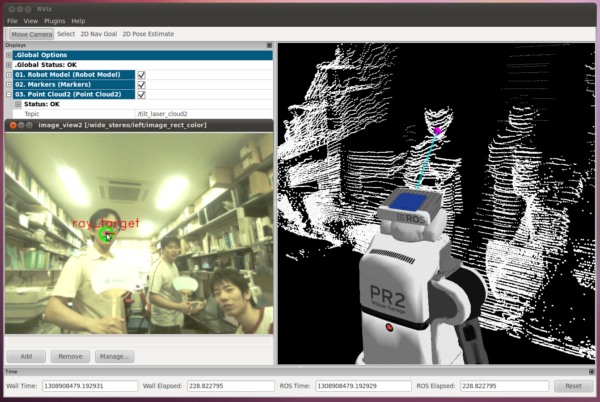
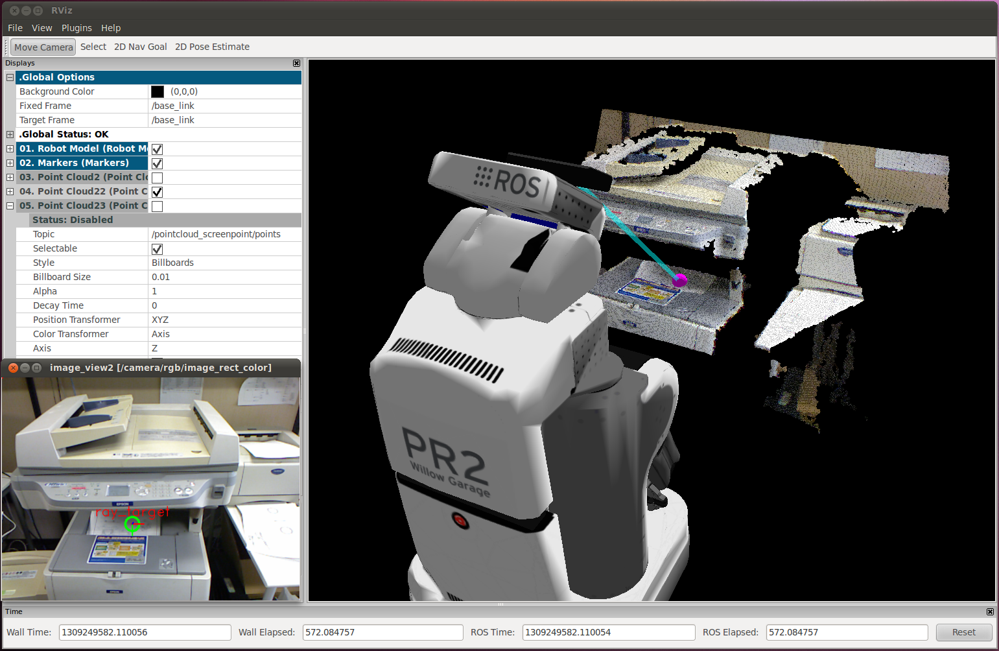
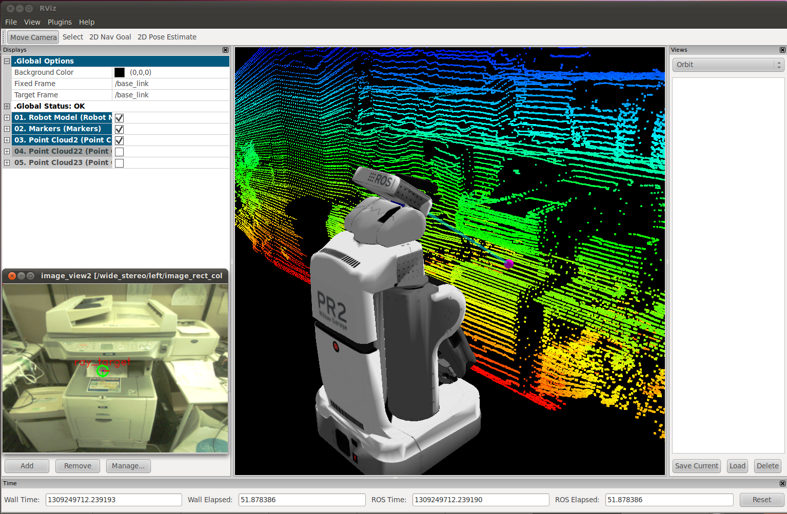
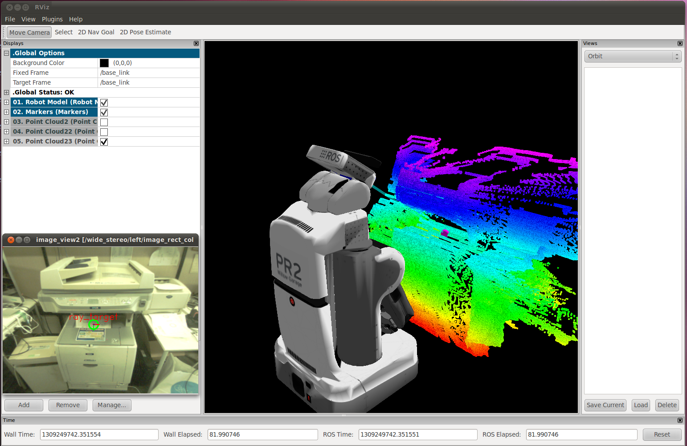

jsk_pcl_ros ROS Launch Files
============================

**Description:** jsk_pcl_ros

  
  
       jsk_pcl_ros
  
    

**License:** BSD

pointcloud_screenpoint_sample.launch
------------------------------------

.. code-block:: bash

  roslaunch jsk_pcl_ros pointcloud_screenpoint_sample.launch

This script displays which point the user pointed on a 2D screen in the 3D rviz.

Sample images below:

There are two parameters to input.

1. 'image' is used in showing a image view on the image_view2, and its camera_info parameter is used for changing the coordinates of points.
2. 'points' is the pointcloud source to estimate 3D points that the user wantedt to specify on a 2D screen.

For example,
By default, pointcloud_screenpoint takes camera image and point clouds from kinect.

.. code-block:: bash

  roslaunch jsk_pcl_ros pointcloud_screenpoint_sample.launch

You can mix wide_stereo camera and assembled_tilt_scan.

.. code-block:: bash

  roslaunch jsk_pcl_ros pointcloud_screenpoint_sample.launch image:=/wide_stereo/left points:=/tilt_laser_cloud2

Or, you can mix kinect camera and assembled_tilt_scan.

.. code-block:: bash

  roslaunch jsk_pcl_ros pointcloud_screenpoint_sample.launch image:=/camera/rgb points:=/tilt_laser_cloud2

pointclouds published by kinect

pointclouds published by laser

amplifiered pointclouds published by laser

  

Contents
########

.. code-block:: xml

  <launch>
    <machine address="pr1012" name="c1" ros-package-path="$(env ROS_PACKAGE_PATH)" ros-root="$(env ROS_ROOT)">
      <env name="PATH" value="$(env PATH)" />
    </machine>
    <arg default="c1" name="cloud_machine" />
    <arg default="localhost" name="display_machine" />
    <arg default="/camera/rgb" name="image" />
    <arg default="/camera/rgb/points" name="points" />
    <include file="$(find jsk_pcl_ros)/launch/pointcloud_screenpoint.launch">
      <arg default="$(arg cloud_machine)" name="cloud_machine" />
      <arg default="$(arg display_machine)" name="display_machine" />
      <arg default="$(arg image)" name="image" />
      <arg default="$(arg points)" name="points" />
    </include>
    <node machine="localhost" name="display_point" output="screen" pkg="jsk_pcl_ros" type="pointcloud_screenpoint.l">
      <param name="~sensor_topic" value="$(arg image)/image_rect_color" />
      <param name="~ray_srv" value="/pointcloud_screenpoint_nodelet/screen_to_point" />
    </node>
    
    
    <node machine="$(arg display_machine)" name="image_view2" pkg="image_view2" type="image_view2">
      <remap from="image" to="$(arg image)/image_rect_color" />
      <remap from="camera_info" to="$(arg image)/camera_info" />
    </node>
    
    
  
    </launch>

background_subtraction.launch
-----------------------------

.. code-block:: bash

  roslaunch jsk_pcl_ros background_subtraction.launch

pointcloud_screenpoint.launch
-----------------------------

.. code-block:: bash

  roslaunch jsk_pcl_ros pointcloud_screenpoint.launch

  Please see pointcloud_screenpoint_sample.launch for documentation.

  

Contents
########

.. code-block:: xml

  <launch>
    <machine address="localhost" env-loader="$(env ROS_ENV_LOADER)" name="localhost" />
    <arg default="localhost" name="cloud_machine" />
    <arg default="/openni/rgb" name="image" />
    <arg default="$(arg image)/camera_info" name="camera_info" />
    <arg default="/openni/depth_registered/points" name="points" />
  
    <node args="manager" machine="$(arg cloud_machine)" name="pointcloud_screenpoint" output="screen" pkg="nodelet" respawn="true" type="nodelet" />
    <node args="load jsk_pcl/DepthImageCreator pointcloud_screenpoint" clear_params="true" machine="$(arg cloud_machine)" name="depth_image_creator_nodelet" output="screen" pkg="nodelet" respawn="true" type="nodelet">
      <remap from="~info" to="$(arg camera_info)" />
      <remap from="~input" to="$(arg points)" />
      <remap from="~output_cloud" to="/pointcloud_screenpoint/points" />
      <rosparam>
      scale_depth: 5.0
      max_queue_size: 10
      use_fixed_transform: false
      use_service: false
      use_asynchronous: false
      use_approximate: true
      </rosparam>
    </node>
    <node args="load jsk_pcl/PointcloudScreenpoint pointcloud_screenpoint" machine="$(arg cloud_machine)" name="pointcloud_screenpoint_nodelet" output="screen" pkg="nodelet" respawn="true" type="nodelet">
      <remap from="~points" to="/pointcloud_screenpoint/points" />
    </node>
    </launch>

