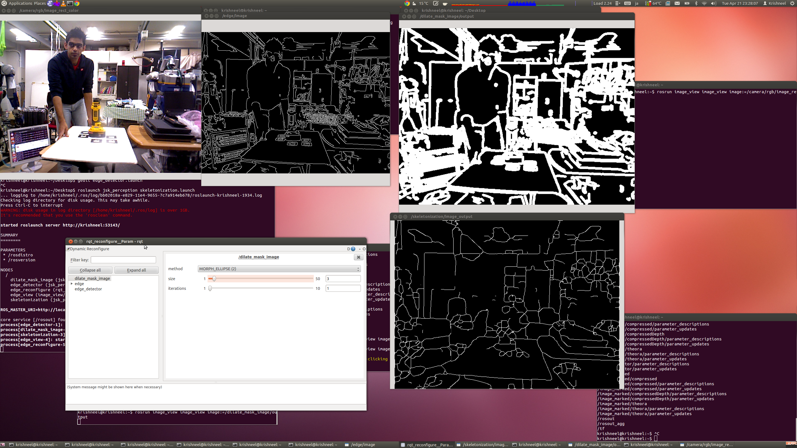

# jsk_perception

## nodes and nodelets

### jsk\_pcl/ColorizeFloatImage


Colorize float image with heatmap gradation.

#### Subscribing Topic
* `~input` (`sensor_msgs/Image`)

  Float(32FC1) image.
#### Publishing Topic
* `~output` (`sensor_msgs/Image`)

  RGB8 image with heatmap gradation.

### jsk\_pcl/ProjectImagePoint


Convert image local coordinates (represented as `geomery_msgs/PointStamped`) into 3-D point.
Z value of the point is specified via dyanmci_reconfigure API.

#### Subscribing Topic
* `~input` (`geometry_msgs/PointStamped`)

  Input point in image local coordinates.
* `~input/camera_info` (`sensor_msgs/CameraInfo`)

  Camera parameter of the original image.

#### Publishing Topic
* `~output` (`geometry_msgs/PointStamped`)

  Output point and the value is scaled to satisfy specified z value.
* `~output/ray` (`geometry_msgs/Vector3Stamped`)

  3-D ray vector of the point of image local coordinates.
#### Parameters
* `~z` (Double, default: `2.0`)

  Z value of projected point.

### jsk\_pcl/RectToROI
Convert rectangle (`geometry_msgs/Polygon`) into ROI with camera info (`sensor_msgs/CameraInfo`).

We expect it will be used with image_view2.

#### Subscribing Topic
* `~input` (`geometry_msgs/Polygon`)

  Polygon to represent rectangle region of image.
* `~input/camera_info` (`sensor_msgs/CameraInfo`)

  Original camera info.

#### Publishing Topic
* `~output` (`sensor_msgs/CameraInfo`)

  camera info with ROI filled by `~input`.

### jsk\_pcl/ROIToRect
Convert camera info with ROI to `geometry_msgs/PolygonStamped`.

#### Subscribing Topic
* `~input` (`sensor_msgs/CameraInfo`)

  Input camera info with ROI filled.

#### Publishing Topic
* `~output` (`geometry_msgs/PolygonStamped`)

  Output rectangle region.

### jsk\_pcl/RectToMaskImage
Convert rectangle (`geometry_msgs/Polygon`) into mask image (`sensor_msgs/Image`)

We expect it will be used with image_view2.

#### Subscribing Topic
* `~input` (`geometry_msgs/Polygon`)

  Polygon to represent rectangle region of image.
* `~input/camera_info` (`sensor_msgs/CameraInfo`)

  Original camera info.

#### Publishing Topic
* `~output` (`sensor_msgs/Image`)

  Mask image.

### jsk\_perception/MaskImageGenerator
Simply generate a mask image according to ~input image and dynamic reconfigure parameters.

#### Subscribing Topic
* `~input` (`sensor_msgs/Image`)

  Input image and it's used to know original width and height.

#### Publishing Topic
* `~output` (`sensor_msgs/Image`)

  Output mask image.

#### Parameters
* `~offset_x` (Int, default: `0`)
* `~offset_y` (Int, default: `0`)
* `~width` (Int, default: `256`)
* `~height` (Int, default: `256`)
  Coordinates of top left point and size of mask image.

### jsk\_perception/PolygonToMaskImage


Convert polygon into mask image.

#### Subscribing Topic
* `~input` (`geometry_msgs/PolygonStamped`)

  Input 3-D polygon.
* `~input/camera_info` (`sensor_msgs/CameraInfo`)

  Input camera info to project 3-D polygon.

#### Publishing Topic
* `~output` (`sensor_msgs/Image`)

  Mask image to fill `~input` polygon. Currently only convex polygon is supported.

### jsk\_perception/PolygonArrayToLabelImage

Convert polygon array into label image. Label starts with 1 and 0 mean the pixel does not
belong to any polygons. No z-buffer is taken into account and occlusion is not solved correctly.

#### Subscribing Topic
* `~input` (`jsk_recognition_msgs/PolygonArray`)

  Input 3-D polygon array.
* `~input/camera_info` (`sensor_msgs/CameraInfo`)

  Input camera info to project 3-D polygon.

#### Publishing Topic
* `~output` (`sensor_msgs/Image`)

  Mask image to fill `~input` polygon. Currently only convex polygon is supported.


### jsk\_perception/ROIToMaskImage
Convert camera info with ROI to mask image.

#### Subscribing Topic
* `~input` (`sensor_msgs/CameraInfo`)

  Input camera info with ROI filled.

#### Publishing Topic
* `~output` (`sensor_msgs/Image`)

  Output mask image.

### jsk\_perception/MaskImageToROI
Convert a mask image into camera info with roi.

#### Subscribing Topic
* `~input` (`sensor_msgs/Image`)

  Input mask image.
* `~input/camera_info` (`sensor_msgs/CameraInfo`)

  Original camera info.

#### Publishing Topic
* `~output` (`sensor_msgs/CameraInfo`)

  Camera info with ROI field filled.

### jsk\_perception/MaskImageToRect
Convert a mask image into geometry_msgs::PolygonStamped.

#### Subscribing Topic
* `~input` (`sensor_msgs/Image`)

  Input mask image.

#### Publishing Topic
* `~output` (`geometry_msgs/PolygonStamped`)

  PolygonStamped message which only contains two points. Minimum point and Maximum point to represent bounding box in image.


### jsk\_perception/ErodeMaskImage, DilateMaskImage, Opening, Closing, MorphologicalGradient, TopHat, BlackHat


Apply morphological transformations.

#### Subscribing Topic
* `~input` (`sensor_msgs/Image`)

  Input image

#### Publishing Topic
* `~output` (`sensor_msgs/Image`)

  Output transformed image.

#### Parameters
* `~method` (`0`, `1` or `2`, default: `0`)

  Method to transform image. 0 means rectangular box model,
  1 meand cross model and 2 means ellipse.

* `~size` (Integer, default: `1`)

  Size to transform.

* `~iterations` (Integer, default: `1`)

  Iterations of transforming image.


### jsk\_perception/GaussianBlur


#### Subscribing Topic
* `~input` (`sensor_msgs/Image`)

  Input image.

#### Publishing Topic
* `~output` (`sensor_msgs/Image`)

  Output transformed image.

#### Parameters
* `~kernel_size` (Integer, default: 11)

  Kernel size for blur transform. It should be odd number.

* `~sigma_x`, `~sigma_y` (Double, default: 10)

  Gaussian kernel standard deviation in X or Y direction.


### jsk\_perception/Kmeans


Apply Kmeans clustering to the input image.

#### Subscribing Topic
* `~input` (`sensor_msgs/Image`)

  Input image.

#### Publishing Topic
* `~output` (`sensor_msgs/Image`)

  Output transformed image.

#### Parameters
* `~n_clusters` (Integer, default: `10`)

  Number of clusters in Kmeans clustering.


### jsk\_perception/Skeletonization


The nodelet is used to obtain the single pixel skeleton of either edges, contours or regions. 
An important use of this nodelet is to fix broken edges on 2D image by first applying Dilation operation to the edges such that the broken edges intersect. By using skeletonization, the dilated image single pixel skeleton structure can be obtained. Note that this is different from erosion, as erosion erodes the edges without preserving the structure. 

For more information refer to [Wikipedia - Zhang-Suen thinning algorithm](http://rosettacode.org/wiki/Zhang-Suen_thinning_algorithm)


#### Subscribing Topic
* `~input` (`sensor_msgs/Image`)

  Currently only supports "MONO8" (single channel 8 bit grayscale)

#### Publishing Topic
* `~output` (`sensor_msgs/Image`)

  float image containing skeleton info of the input image. 1 presents the skeleton.


### jsk\_perception/GridLabel


Generate labels of grid.

#### Subscribing Topic
* `~input` (`sensor_msgs/CameraInfo` or `sensor_msgs/Image`)

  Input is `sensor_msgs/CameraInfo` or `sensor_msgs/Image`.
  If `use_camera_info` is true, `sensor_msgs/CameraInfo` will be used.
  If `use_camera_info` is false, `sensor_msgs/Image` will be used.
#### Publishing Topic
* `~output` (`sensor_msgs/Image (CV_32SC1)`)

  Output labels as image. Encoding is `CV_32SC1`.
#### Parameters
* `~label_size` (Integer, default: `32`)

  label size
* `~use_camera_info` (Boolean, default: `false`)

  if this parameter is true, it uses `sensor_msgs/CameraInfo` for `~input`.

### jsk\_perception/ApplyMaskImage


Apply mask image to original image and visualize it. It's a utlity to visualize mask image.

#### Subscribing Topic
* `~input` (`sensor_msgs/Image`)

  Original image.
* `~input/mask` (`sensor_msgs/Image`)

  Mask image.
#### Publishing Topic
* `~output` (`sensor_msgs/Image`)

  Masked image. The image is clipped by bounding box of mask image and filtered by the mask.
  The region not specified by mask image is filled by 0.
* `~output/mask` (`sensor_msgs/Image`)

  Clipped mask image. The image is clipped by bounding box of mask image.

#### Parameters
* `~approximate_sync` (Bool, default: `false`)

  Approximately synchronize inputs if it's true.

* `~mask_black_to_transparent` (Bool, default: `false`)

  Change black region of mask image to transparent and publish RGBA8 image as `~output` if its' true.

### jsk\_perception/UnpplyMaskImage


Unapply mask image to the size of original image.

#### Subscribing Topic
* `~input` (`sensor_msgs/Image`)

  Masked image.
* `~input/mask` (`sensor_msgs/Image`)

  Mask image.
#### Publishing Topic
* `~output` (`sensor_msgs/Image`)

  Unmasked image. The region outside of mask image is filled by black (0).

#### Parameters
* `~approximate_sync` (Bool, default: `false`)

  Approximately synchronize inputs if it's true.

### jsk\_perception/SLICSuperPixels


Compute super pixels based on SLIC based on "SLIC Superpixels Compared to State-of-the-art Superpixel Methods" (TPAMI 2012).
jsk\_perception use implementation of https://github.com/PSMM/SLIC-Superpixels, https://github.com/berak/SLIC-Superpixels and https://github.com/garaemon/SLIC-SuperPixels.

Output of this node is an image and each value means label index.

#### Subscribing Topic
* `~input` (`sensor_msgs/Image`)

  Input image.
#### Publishing Topic

* `~output` (`sensor_msgs/Image`)

  Output image. The encoding of image is `CV_32SC1` and each element value means label index.
* `~debug` (`sensor_msgs/Image`)

  Debug image, each border of cluster drawn by red contour.
* `~debug/mean_color` (`sensor_msgs/Image`)

  Debug image, each cluster is drawn by mean color of the cluster.
* `~debug/center_grid` (`sensor_msgs/Image`)

  Debug image, Center of each cluster is plotted by red dot.
#### Parameters
* `~number_of_super_pixels` (Integer, default: `100`)

  The number of super pixels.
* `~weight` (Integer, default: `4`)

  Weight of metrics between color and pixel distance.

### jsk\_perception/LabDecomposer
Decompose BGR/RGB image into separate planes in [CIE-Lab color space](http://en.wikipedia.org/wiki/Lab_color_space).

#### Subscribing Topic
* `~input` (`sensor_msgs/Image`)

  Input image.
#### Publishing Topic
* `~output/l` (`sensor_msgs/Image`)
* `~output/a` (`sensor_msgs/Image`)
* `~output/b` (`sensor_msgs/Image`)
  L*, a and b separated planes. Each image has CV_8UC encoding.

### jsk\_perception/YCCDecomposer
Decompose BGR/RGB image into separate planes in [YCbCr color space](http://en.wikipedia.org/wiki/YCbCr).

#### Subscribing Topic
* `~input` (`sensor_msgs/Image`)

  Input image.
#### Publishing Topic
* `~output/y` (`sensor_msgs/Image`)
* `~output/cr` (`sensor_msgs/Image`)
* `~output/cb` (`sensor_msgs/Image`)
  Y, Cr and Cb separated planes. Each image has CV_8UC encoding.

### jsk\_perception/SingleChannelHistogram
Compute histogram of single channel image.

#### Subscribing Topic
* `~input` (`sensor_msgs/Image`)

  Input image. It should has CV_8UC1 as encoding.

* `~input/mask` (`sensor_msgs/Image`)

  Mask image. if `~use_mask` is true, histogram is computed with this mask image.
#### Publishing Topic
* `~output` (`jsk_recognition_msgs/ColorHistogram`)

  Histogram of `~input` image.

#### Parameters
* `~use_mask` (Boolean, default: `false`)

  If this parameter is set true, histogram is computed with mask image.

* `~hist_size` (Integer, default: `10`)

  The number of bins of histogram

* `~min_value` (Double, default: `0.0`)
* `~max_value`(Double, default: `256.0`)

  Minimum and maximum value of histogram

### jsk\_perception/ColorHistogramLabelMatch


Compute similar region of image to specified histogram based on superpixels image.

Sample is `color_histogram_label_match_sample.launch`.

#### Input Topic
* `~input/histogram` (`jsk_recognition_msgs/ColorHistogram`)

  Reference histogram.
* `~input` (`sensor_msgs/Image`)

  Input image. This image should be bgr8 or rgb8 image.
* `~input/label` (`sensor_msgs/Image`)

  Label of ~input image. Label image should be int32 image.
* `~input/mask` (`sensor_msgs/Image`)

  Mask image of ~input image. Only masked region is taken into account.

#### Publishing Topic
* `~output/extracted_region` (`sensor_msgs/Image`)

  Result of correlation computation as mask image.
* `~output/coefficient_image` (`sensor_msgs/Image`)

  Result of correlation computation as float image.
* `~debug` (`sensor_msgs/Image`)

  Debug image
#### Parameters
* `~coefficient_method`

  Method to compute coefficient
* `~max_value` (Default: `255`)
* `~min_value` (Default: `0`)

  Maximum and minimum index of histogram
* `~masked_coefficient` (Default: `0.0`)

  Value to fill masked region
* `~threshold_method`

  Method to binalize coefficient image.
* `~coef_threshold`

  Threshold used in binalization.
* `~use_mask` (Default: `false`)

  Do not use mask image if this parameter is false.

### jsk\_perception/BlobDetector


Detect blob of binary image and output label of it.
The implementation is based on [Imura's implementation](http://oshiro.bpe.es.osaka-u.ac.jp/people/staff/imura/products/labeling).

#### Subscribing Topic
* `~input` (`sensor_msgs/Image`)

  Input image. It should be single channel.
#### Publishing Topic
* `~output` (`sensor_msgs/Image`)

  Label image. Each pixel value means the label which the pixel should belong to and 0 means
  the pixel is masked (black in `~input` image)

#### Parameter
* `~min_size` (Integer, default: `10`)

  Minimum size of blob

### jsk\_perception/AddMaskImage


Add two mask image into one mask image.

#### Subscribing Topic
* `~input/src1` (`sensor_msgs/Image`)
* `~input/src2` (`sensor_msgs/Image`)

  Input mask images.
#### Publishing Topic
* `~output` (`sensor_msgs/Image`)

  Added mask image.
#### Parameters
* `~approximate_sync` (Bool, default: `false`)

  Approximately synchronize `~input/src1` and `~input/src2` if it's true.

### jsk\_perception/MultiplyMaskImage


Multiply (bitwise) two mask image into one mask image.

#### Subscribing Topic
* `~input/src1` (`sensor_msgs/Image`)
* `~input/src2` (`sensor_msgs/Image`)

  Input mask images.
#### Publishing Topic
* `~output` (`sensor_msgs/Image`)

  Added mask image.
#### Parameters
* `~approximate_sync` (Bool, default: `false`)

  Approximately synchronize `~input/src1` and `~input/src2` if it's true.

### jsk\_perception/FisheyeToPanorama
This nodelet will publish Rectified or Panoramized Fisheye Image.
We recomend you to set scale factor as small as possible to reduce calculation.
This  was tested with Prosilica GC2450C and NM30 lens.
Below pictures show rectify image system.


#### Subscribing Topic
* `~input` (`sensor_msgs/Image`)

  Input mask images.
#### Publishing Topic
* `~output` (`sensor_msgs/Image`)

  Rectified or Panoramized Image

* `~output_biliner` (`sensor_msgs/Image`)

  When Simaple Panorama Mode, publish Panoramized Image

#### Parameters
* `~use_panorama` (Bool, default: `false`)

  If true=> publish Parnorama View Image
  If false=> publish Rectified View Image

* `~simple_panorama` (Bool, default: `false`)

  This is effective only when use_panorama = true
  If true => show Simple Panorama View
  If false => show Calcurated Panorama View

### jsk\_perception/SlidingWindowObjectDetector

#### What is this?
This nodelet performs supervised object detection through binary support vector machine trained object classifier. The Nodelet uses a sliding window detection method as a raster scaning of the image. Currently, the detector is trained on Histogram of Oriented Gradients and HS Color histogram. To train this detector please use the custom implemented `jsk\_perception/SlidingWindowObjectDetectorTrainer` nodelet bundled in jsk_perception pkg.

Note that this nodelet reads a trainer manifest file, customed named to "sliding_window_trainer_manifest.xml" which is one of the outputs of SlidingWindowObjectDetectorTrainer. This manifest file contains specific configurations of the trainer, the feature dimensionalities, the detector window size and the output directories with filenames. 

#### Usage

The nodelet can be configured to run as either:
* `1) a detector (DETECTOR)` - where the nodelet simply loads the manifest and trainer and performs object detection.
* `2) a bootstraper (BOOTSTRAPER)` - this mode, is used to refine the trained classifier by accumulating the false positive detection in the environment to re-train the detector. This method helps reduce the false positives. Note when doing bootstrapping make sure that the object of interest is `NOT` in the environment. The nodelet before doing bootstrapping will load the negative training bag file, read, and will write using the same name and will append the images from bootstrapping to the bag. This is done to set all training set to similar time stamps. 


#### Subscribing Topic
* `~input` (`sensor_msgs/Image`)

  Input mask images.
#### Publishing Topic
* `~output/image` (`sensor_msgs/Image`)

  Raw image marked with bounding boxes of detected objects.

* `~output/rects` (`jsk_recognition_msgs/RectArray`)

  Array of detected bounding boxes

#### Parameters
* `~run_type` (string, default: `DETECTOR`)
  Run the nodelet as. see above

* `~image_downsize` (Int, default: `2`)

  Reduces the image by this factor. (Smaller image dimensions makes processing faster)

* `~scaling_factor` (float, default: `-0.06`)

  Scale factor for pymdical scaling of the window. 
  `+` value indices increase while `-` is reduces. 


* `~stack_size` (int, default: `2`)

  Spefices the number of times a window is to be changed for raster scanning. 
  The changed factor for each traversal is determined by `~scaling_factor`
  
* `~sliding_window_increment` (int, default: `16`)

  Spefices the number of pixels to shift the window for next detection. 


Note that this parameters are critical in determining the detection rate and the speed of execution. 
Please fine tune the parameters accordingly to get the best performance. 
  

### jsk\_perception/SlidingWindowObjectDetectorTrainer
#### What is this?
Nodelet to train `jsk\_perception/SlidingWindowObjectDetector` using binary support vector machine. The object is assigned a label of +1 and -1 otherwise. The SVM used is from the OpenCV Library with default set to RBF Kernel and 10-Fold Cross Validations. 

Note that this nodelet produces two output files of ".xml" format to the working directory.
* `1) Trained Classifier` - this file the trained object SVM. Dont edit this file.
* `2) sliding_window_trainer_manifest.xml` - this file contains parameters of the trainer that are not in (1). Information such as trainer window size, save directory, etc. 


#### Parameters
* `~dataset_path` (string, default: `training_dataset`)

  Folder name where the training sets resides.

* `~object_dataset_filename` (string)

   Rosbag file name of the object (positive) training set 

* `~nonobject_dataset_filename` (string)

   Rosbag file name of the non-object (negative) training set 

* `~classifier_name` (string)

   Name of the trained svm output file

* `~swindow_x` (int, default: `32`)

   Window width

* `~swindow_y` (int, default: `64`)

   Window height  

### jsk\_perception/"Bag of Features for Object Recognition"

(Demo of recognizing oreo snack from novel image input.)

#### Tools
* scripts/create\_feature0d\_dataset.py, launch/create\_feature0d\_dataset.launch
    * extract descriptor features from images.
    * the input data path format should be like below:

```
──image_dataset
   ├── champion_copper_plus_spark_plug
   │   ├── img0000.jpg
   │   ├── img0001.jpg
   │   ├── img0002.jpg
   │   ...
   ├── cheezit_big_original
   ├── crayola_64_ct
   ├── dr_browns_bottle_brush
   ...
```

* scripts/extract\_bof.py
    * extract BoF from descriptor features. (see --help for more)

#### Example
```sh
# donwload sample data
$ roscd jsk_data && make large KEYWORD:=jsk_2014_picking_challenge/20150428_collected_images
$ wget https://i.warosu.org/data/ck/img/0048/57/1381305564234.jpg -O /tmp/oreo_mega_stuf_sample.jpg
# create descriptors dataset
$ roslaunch jsk_perception create_feature0d_dataset.launch container_path:=`rospack find jsk_data`/large/20150428_collected_images
# extract bag of features & its histogram
$ rosrun jsk_perception extract_bof.py fit `rospack find jsk_perception`/trained_data/feature0d_dataset.pkl.gz -O `rospack find jsk_perception`/trained_data/bof.pkl.gz
$ rosrun jsk_perception extract_bof.py dataset `rospack find jsk_perception`/trained_data/feature0d_dataset.pkl.gz `rospack find jsk_perception`/trained_data/bof.pkl.gz -O `rospack find jsk_perception`/trained_data/bof_hist.pkl.gz
# train classifier
$ rosrun jsk_perception simple_classifier_trainer.py `rospack find jsk_perception`/trained_data/bof_hist.pkl.gz -O `rospack find jsk_perception`/trained_data/clf.pkl.gz
# run for novel image
$ roscore
$ rosrun jsk_perception image_publisher.py _file_name:=/tmp/oreo_mega_stuf_sample.jpg
$ rosrun imagesift imagesift image:=/image_publisher/output
$ rosrun jsk_perception extract_bof.py extract `rospack find jsk_perception`/trained_data/bof.pkl.gz
$ rosrun jsk_perception simple_classifier.py _clf_path:=`rospack find jsk_perception`/trained_data/clf.pkl.gz
# check the result
$ rostopic echo /simple_classifier/output
data: oreo_mega_stuf
...
```
